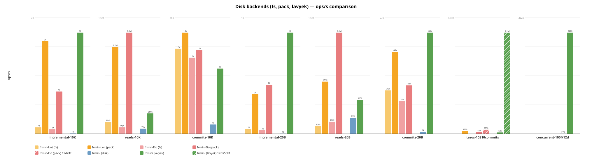
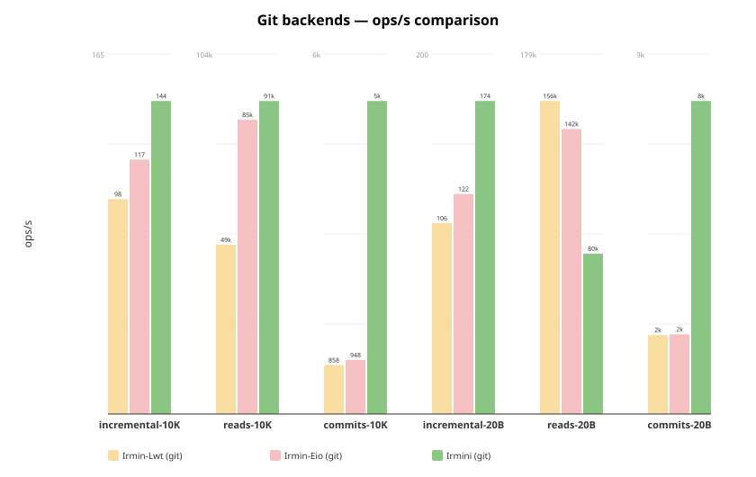
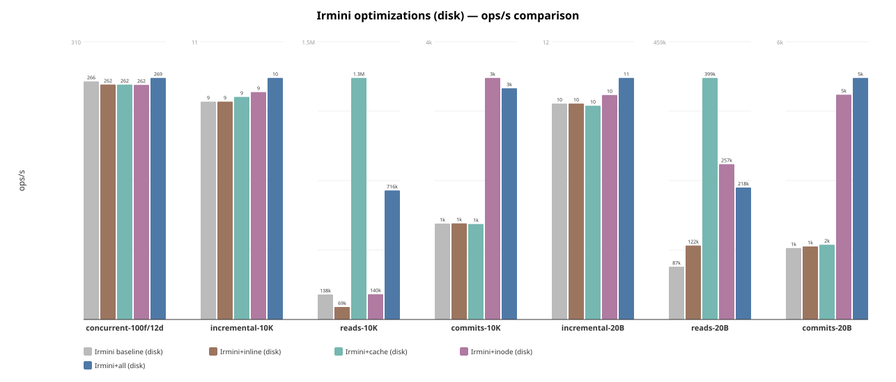
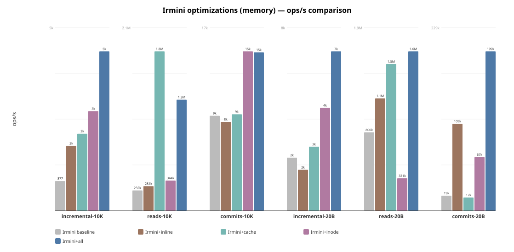

# Irmini Benchmarks

Performance comparison across all Irmin implementations and backends.

## Implementations

| Implementation | Branch / Repo | Concurrency | Description |
|---|---|---|---|
| **Irmin-Lwt** | irmin `main` | Lwt | Official Irmin with Lwt |
| **Irmin-Eio** | irmin `cuihtlauac-inline-small-objects-v2` | Eio | Official Irmin with Eio + inlining |
| **Irmini** | irmini `perf` | Eio | Irmini with all optimizations |

Each implementation is benchmarked with multiple backends: memory, fs, git, pack/lavyek.

## Prerequisites

To reproduce all benchmarks, you need:

1. **Monopampam monorepo** — contains irmini + its dependencies (lavyek, ocaml-wal,
   ocaml-bloom, etc.)
2. **Irmin checkout** — the official [irmin](https://github.com/mirage/irmin) repo,
   with two branches:
   - `main` — for Irmin-Lwt benchmarks
   - `cuihtlauac-inline-small-objects-v2` — for Irmin-Eio benchmarks
3. **Tezos trace file** *(optional, for trace replay)* — `data4_10310commits.repr`
   (267 MiB), placed at the root of the irmin checkout. This file contains 10,310
   Tezos blocks totaling ~4M operations.

The `run_all.sh` script handles branch switching automatically. Set `IRMIN_DIR`
to point to your irmin checkout.

## Quick start

Run everything and update README (recommended):

```
cd /path/to/monopampam
IRMIN_DIR=/path/to/irmin ./irmini/bench/run_bench.sh
```

This runs all benchmarks (irmini + irmin), generates SVG charts, and updates
the Results section of this README. Without `IRMIN_DIR`, only irmini benchmarks
are run and Irmin comparison rows are omitted from the tables.

`run_bench.sh` options:

| Flag                     | Default | Description                                    |
|--------------------------|---------|------------------------------------------------|
| `--skip-irmini`          |         | Skip irmini standard benchmarks (step 1)       |
| `--skip-optims`          |         | Skip optimization comparison (step 2)          |
| `--skip-trace`           |         | Skip trace replay (step 3)                     |
| `--skip-parallel`        |         | Skip parallel scaling sweep (step 4)           |
| `--skip-irmin`           |         | Skip Irmin-Lwt/Eio benchmarks (step 5)         |
| `--skip-charts`          |         | Skip chart generation (step 6)                 |
| `--skip-readme`          |         | Skip README update (step 7)                    |
| `--trace FILE`           | auto    | Path to `.repr` trace file                     |
| `--trace-commits N`      | 10310   | Max commits to replay                          |
| `--parallel-fibers LIST` | 1,10,...,100000 | Comma-separated fiber counts for scaling sweep |
| `--parallel-domains N`   | 12      | Number of OS domains for parallel replay       |
| `--ncommits N`           | 100     | Override commit count (passed to benchmarks)   |
| `--tree-add N`           | 1000    | Override tree-add (passed to benchmarks)       |

Steps: 1) Irmini standard (all backends), 2) Optimization comparison (5 variants
× disk/memory), 3) Trace replay (sequential), 4) Parallel scaling sweep (14
fiber counts), 5) Irmin-Lwt/Eio benchmarks + trace replay (needs `IRMIN_DIR`),
6) Generate SVG charts, 7) Update this README from JSON results.

Irmini only (from monopampam monorepo):

```
cd /path/to/monopampam
dune exec irmini/bench/bench_irmin4_main.exe -- --json bench/results/irmini.json
```

Full comparison across all implementations:

```
IRMIN_DIR=/path/to/irmin ./bench/run_all.sh
```

Simple irmini + irmin-eio comparison:

```
IRMIN_EIO_DIR=/path/to/irmin ./bench/run.sh
```

Irmini per-optimization comparison (baseline, +inline, +cache, +inode, +all):

```
cd /path/to/monopampam
./irmini/bench/run_optims.sh
```

Tezos trace replay (irmini, all active backends):

```
cd /path/to/monopampam
dune exec irmini/bench/bench_irmin4_main.exe -- \
  --trace /path/to/data4_10310commits.repr --trace-commits 10310
```

Tezos trace replay (irmin, disk and memory):

```
cd /path/to/irmin
dune exec bench/irmin-pack/tree.exe -- \
  --mode=trace --store-type=pack --ncommits-trace=10310 \
  --empty-blobs data4_10310commits.repr

dune exec bench/irmin-pack/tree.exe -- \
  --mode=trace --store-type=pack-mem --ncommits-trace=10310 \
  --empty-blobs data4_10310commits.repr
```

## Options

| Flag                  | Default | Description                              |
|-----------------------|---------|------------------------------------------|
| `--ncommits`          | 100     | Number of commits                        |
| `--tree-add`          | 1000    | Tree entries added per commit            |
| `--depth`             | 10      | Depth of paths                           |
| `--nreads`            | 10000   | Number of reads in read scenario         |
| `--value-size`        | 100     | Size of values in bytes                  |
| `--skip-memory`       | false   | Skip the memory backend                  |
| `--skip-lavyek`       | false   | Skip the Lavyek backend                  |
| `--skip-disk`         | false   | Skip the disk backend                    |
| `--skip-git`          | false   | Skip the git backend                     |
| `--cache`             | 0       | LRU cache capacity (0 = no cache)        |
| `--no-inode`          | false   | Disable inode splitting                  |
| `--name`              | —       | Override benchmark name                  |
| `--json`              | —       | Write JSON results to file               |
| `--trace`             | —       | Run trace replay from .repr file         |
| `--trace-commits`     | 0       | Max commits to replay (0 = all)          |
| `--trace-empty-blobs` | false   | Replace blobs with empty strings         |
| `--no-flatten`        | false   | Disable Tezos path flattening            |
| `--parallel-domains`  | 0       | Domains for parallel replay (0 = skip)   |
| `--parallel-fibers`   | 100     | Fibers per domain for parallel replay    |

## Scenarios

Each scenario runs twice: once with small values (from `--value-size`, default
20B) and once with large values (10 KiB). Scenario names include the value
size suffix, e.g. `commits-20B`, `commits-10K`.

Running with small values (below the 48-byte inline threshold, e.g. 20B)
tests the effectiveness of **value inlining** (small values stored directly
in tree nodes, avoiding content-addressable store lookups). Running with
large values (10 KiB) tests raw I/O throughput where inlining cannot help.

1. **commits** — Performs `ncommits` sequential commits, each adding
   `tree-add` entries at `depth`-level paths. Each commit reads the current
   tree, adds entries, then serializes and stores the new tree + commit
   object. This is the primary **write throughput** benchmark: it exercises
   tree construction, content-addressable hashing, and backend write I/O.
   It is sensitive to **inlining** (fewer store writes when values are
   inlined), **inodes** (O(log n) tree updates instead of O(n)
   re-serialization), and **backend write speed**.

2. **reads** — Populates a tree with `tree-add` entries, commits it, then
   performs `nreads` random lookups by path from the committed tree. The tree
   is loaded fresh from the store (not from memory), so each read must
   navigate the serialized tree structure and fetch content from the backend.
   This is the primary **read throughput** benchmark: it exercises tree
   navigation, deserialization, and backend read I/O. It is sensitive to
   **LRU cache** (avoids repeated deserialization), **inodes** (O(log n)
   navigation), and **resolved-child cache** (avoids re-navigating already
   resolved subtrees).

3. **incremental** — Builds a large tree (`tree-add` entries), commits it,
   then performs `ncommits` commits each modifying a single entry. Each
   iteration checks out the tree, updates one path, and commits. This
   simulates the common real-world pattern of **small updates on a large
   tree** (e.g. updating a single file in a repository). Without structural
   sharing (inodes), the entire tree must be re-serialized on each commit
   even though only one entry changed. With **inodes**, only the affected
   HAMT trie path is rewritten (O(log n) instead of O(n)). This scenario
   is the most sensitive to inode optimization.

4. **concurrent** *(disk, lavyek only)* — Pre-populates the backend with
   1000 objects, then spawns `nfibers` (default 100) fibers distributed
   across up to 12 OS domains. Each fiber performs `nreads / nfibers`
   iterations of alternating write + read operations directly on the
   backend (bypassing the tree layer). This measures **raw backend
   throughput under contention**: lock-free data structures (lavyek),
   mutex overhead (disk), and OS-level I/O parallelism.

5. **trace-replay** *(via `--trace`)* — Replays a recorded Tezos trace
   (`.repr` file in `IrmRepBT` format) against the store. The trace
   contains real operations from a Tezos node: Checkout, Add, Remove,
   Copy, Find, Mem, Mem_tree, Commit. This is the most **realistic**
   benchmark as it reproduces actual Tezos workloads with realistic
   tree shapes and access patterns. The `data4_10310commits.repr` trace
   contains 10,310 blocks totaling 4 million operations.

## Files

| File                      | Description                                 |
|---------------------------|---------------------------------------------|
| `bench_common.ml`         | Timing, result types, comparison tables      |
| `bench_irmin4.ml`         | Scenarios for irmini memory and disk backends |
| `bench_irmin4_lavyek.ml`  | Scenarios for Lavyek backend                 |
| `trace_replay.ml`         | Tezos trace replay benchmark                 |
| `trace_replay_parallel.ml`| Parallel multicore trace replay               |
| `bench_irmin4_main.ml`    | CLI runner for all irmini backends            |
| `run_bench.sh`            | **Master script**: runs all benchmarks, generates charts, updates README |
| `run.sh`                  | Simple comparison (irmini + Irmin-Eio)       |
| `run_all.sh`              | Full comparison across all implementations   |
| `run_optims.sh`           | Per-optimization comparison (5 variants)     |
| `gen_chart.py`            | Chart from hardcoded data (legacy)           |
| `gen_chart_all.py`        | Charts from JSON results by backend type     |
| `gen_chart_parallel.py`   | Parallel scaling chart (from JSON or fallback)|
| `gen_readme_results.py`   | Generates README results section from JSON   |
| `bench-irmin-eio/`        | Irmin-Eio benchmark adapters + parallel trace replay |
| `bench-irmin-lwt/`        | Irmin-Lwt benchmark adapters                 |

## Results

Run on 2026-03-10, AMD 12-core, 100 commits × 1000 adds, depth 10, 10000 reads.
Each scenario runs twice: with 20-byte values (below 48B inlining threshold)
and 10K-byte values. All three implementations use the same parameters.

### Disk backends (fs, pack, lavyek)



```
Name                           Scenario               ops/s     total(s)   RSS(MiB)
----------------------------------------------------------------------------------
Irmin-Lwt (pack)               commits-20B            68438        1.461        276
Irmin-Lwt (pack)               reads-20B             719003        0.014        276
Irmin-Lwt (pack)               incremental-20B         1510        0.066        276
Irmin-Lwt (pack)               commits-10K            14309        6.988        459
Irmin-Lwt (pack)               reads-10K            1210198        0.008        459
Irmin-Lwt (pack)               incremental-10K         2469        0.041        459
Irmin-Eio (pack)               commits-20B            40452        2.472        546
Irmin-Eio (pack)               reads-20B            1393734        0.007        402
Irmin-Eio (pack)               incremental-20B         1871        0.053        400
Irmin-Eio (pack)               commits-10K            11852        8.437        399
Irmin-Eio (pack)               reads-10K            1410229        0.007        208
Irmin-Eio (pack)               incremental-10K         1128        0.089        208
Irmin-Lwt (fs)                 commits-20B            36269        2.757        516
Irmin-Lwt (fs)                 reads-20B             105923        0.094        517
Irmin-Lwt (fs)                 incremental-20B          180        0.556        537
Irmin-Lwt (fs)                 commits-10K            12030        8.313        517
Irmin-Lwt (fs)                 reads-10K             163854        0.061        517
Irmin-Lwt (fs)                 incremental-10K          175        0.572        517
Irmin-Eio (fs)                 commits-20B            27228        3.673        524
Irmin-Eio (fs)                 reads-20B             166434        0.060        524
Irmin-Eio (fs)                 incremental-20B          136        0.733        524
Irmin-Eio (fs)                 commits-10K            10767        9.287        524
Irmin-Eio (fs)                 reads-10K              91709        0.109        524
Irmin-Eio (fs)                 incremental-10K          123        0.811        559
Irmini (lavyek)                commits-20B            84425        1.184        367
Irmini (lavyek)                reads-20B             466874        0.021        330
Irmini (lavyek)                incremental-20B         3857        0.026        360
Irmini (lavyek)                commits-10K             9229       10.835        360
Irmini (lavyek)                reads-10K             285977        0.035        261
Irmini (lavyek)                incremental-10K         2697        0.037        246
Irmini (lavyek)                concurrent-100f/12d   227511        0.088        228
Irmini (disk)                  commits-20B             1542       16.215         81
Irmini (disk)                  reads-20B             219462        0.023         82
Irmini (disk)                  incremental-20B           10        4.920         78
Irmini (disk)                  commits-10K             1324       18.877         78
Irmini (disk)                  reads-10K              71370        0.070         76
Irmini (disk)                  incremental-10K            10        5.165         67
Irmini (disk)                  concurrent-100f/12d      271       36.874         59
Irmini (lavyek)                tezos-10310commits     67971       58.848        758
Irmin-Eio (pack) 12d×1f       tezos-10310commits    205337       19.500          —
Irmini (lavyek) 12d×50kf      tezos-10310commits   5063000        0.790       1815
```

- **Irmini (lavyek)**: Commits at **84k ops/s** (20B) — faster than all Irmin
  backends. Reads at 467k (20B), 286k (10K). Concurrent at **228k ops/s**.
- **Irmini (disk)**: WAL+bloom backend with crash safety. Reads at 219k (20B),
  71k (10K). Writes bottlenecked by WAL fsync: commits at 1.5k, incremental
  at ~10 ops/s. Trade-off: durability over raw speed.
- **irmin-pack**: Reads at 719k–1.4M ops/s, commits at 12–68k ops/s.
  Irmin-Lwt faster on commits (68k vs 40k), Irmin-Eio faster on reads (1.4M vs 719k).
- **irmin-fs**: Slower across the board. Reads 106–166k, commits 11–36k.
- **trace-replay**: Irmini (lavyek) replays 10,310 real Tezos commits (4M
  operations) at **68K ops/sec**. Irmini (memory) at 71K ops/sec.
- **parallel trace-replay** (hatched bars): Irmini (lavyek) at **5.1M ops/s**
  with 12 domains × 50k fibers (94× speedup). Irmin-Eio (pack) at **205k ops/s**
  with 12 domains × 1 fiber (1.9× speedup) — limited by irmin-pack batch serialization.

### Memory backends


```
Name                           Scenario               ops/s     total(s)   RSS(MiB)
----------------------------------------------------------------------------------
Irmin-Lwt (memory)             commits-20B           161042        0.621         73
Irmin-Lwt (memory)             reads-20B            1253453        0.008         73
Irmin-Lwt (memory)             incremental-20B         1175        0.085         76
Irmin-Lwt (memory)             commits-10K            16166        6.186        187
Irmin-Lwt (memory)             reads-10K             522818        0.019        188
Irmin-Lwt (memory)             incremental-10K          852        0.117        190
Irmin-Eio (memory)             commits-20B           162259        0.616        203
Irmin-Eio (memory)             reads-20B            1271464        0.008        157
Irmin-Eio (memory)             incremental-20B         1440        0.069        155
Irmin-Eio (memory)             commits-10K            16103        6.210        151
Irmin-Eio (memory)             reads-10K             552602        0.018         68
Irmin-Eio (memory)             incremental-10K         1249        0.080         61
Irmini (memory)                commits-20B            93912        1.065         91
Irmini (memory)                reads-20B             479782        0.021         77
Irmini (memory)                incremental-20B         4741        0.021         76
Irmini (memory)                commits-10K            16106        6.209         74
Irmini (memory)                reads-10K             361846        0.028         48
Irmini (memory)                incremental-10K         3674        0.027         43
Irmini (memory)                tezos-10310commits     71055       56.294        584
```

- **Commits (20B)**: Irmin ~162k ops/s vs Irmini **94k** — Irmin's in-memory
  tree is faster on bulk writes (no content-addressed hashing overhead).
- **Reads (20B)**: Irmin 1.25–1.27M vs Irmini **480k** — Irmin keeps the
  full tree in memory; irmini navigates content-addressed structures.
- **Incremental (20B)**: Irmini at **4.7k ops/s** is **3.3–4× faster** than
  Irmin (1.2–1.4k) thanks to inode structural sharing.
- **10K values**: All three converge on commits (~16k ops/s) — I/O dominates.
  Irmini uses **43–91 MiB** vs Irmin 61–203 MiB.

### Git backends



```
Name                           Scenario               ops/s     total(s)   RSS(MiB)
----------------------------------------------------------------------------------
Irmin-Lwt (git)                commits-20B             2021       49.484        482
Irmin-Lwt (git)                reads-20B             156067        0.064        483
Irmin-Lwt (git)                incremental-20B          106        0.943        483
Irmin-Lwt (git)                commits-10K              859      116.469        492
Irmin-Lwt (git)                reads-10K              49093        0.204        487
Irmin-Lwt (git)                incremental-10K           99        1.011        483
Irmin-Eio (git)                commits-20B             2039       49.046        507
Irmin-Eio (git)                reads-20B             142120        0.070        508
Irmin-Eio (git)                incremental-20B          122        0.817        508
Irmin-Eio (git)                commits-10K              949      105.424        514
Irmin-Eio (git)                reads-10K              85357        0.117        509
Irmin-Eio (git)                incremental-10K          117        0.854        524
Irmini (git)                   commits-20B             8006       12.490         58
Irmini (git)                   reads-20B              79962        0.125         83
Irmini (git)                   incremental-20B          174        0.574         83
Irmini (git)                   commits-10K             5498       18.190         85
Irmini (git)                   reads-10K              90818        0.110         86
Irmini (git)                   incremental-10K          144        0.694         61
```

- **Irmini (git)**: 100% git-compatible (inodes disabled, no inlining).
  Commits at **8k ops/s** — **4× faster** than Irmin (2k).
  Uses **58–86 MiB RSS** vs Irmin's 480–520 MiB.
- **Reads**: Irmin-Lwt leads on 20B (156k vs 80k) thanks to in-memory caching.
  On 10K, Irmini (91k) matches Irmin-Eio (85k) and beats Irmin-Lwt (49k).
- **Incremental**: All comparable (~100–174 ops/s) — dominated by Git I/O.

### Irmini optimizations (disk)



```
Name                           Scenario               ops/s
------------------------------------------------------------
Irmini baseline (disk)         commits-20B             1446
Irmini baseline (disk)         reads-20B              87307
Irmini baseline (disk)         incremental-20B           10
Irmini baseline (disk)         commits-10K             1280
Irmini baseline (disk)         reads-10K             138462
Irmini baseline (disk)         incremental-10K            9
Irmini baseline (disk)         concurrent-100f/12d      266
Irmini+inline (disk)           commits-20B             1478
Irmini+inline (disk)           reads-20B             122312
Irmini+inline (disk)           incremental-20B           10
Irmini+inline (disk)           commits-10K             1282
Irmini+inline (disk)           reads-10K              69296
Irmini+inline (disk)           incremental-10K            9
Irmini+inline (disk)           concurrent-100f/12d      263
Irmini+cache (disk)            commits-20B             1513
Irmini+cache (disk)            reads-20B             399458
Irmini+cache (disk)            incremental-20B           10
Irmini+cache (disk)            commits-10K             1274
Irmini+cache (disk)            reads-10K            1339434
Irmini+cache (disk)            incremental-10K            9
Irmini+cache (disk)            concurrent-100f/12d      262
Irmini+inode (disk)            commits-20B             4548
Irmini+inode (disk)            reads-20B             256740
Irmini+inode (disk)            incremental-20B           10
Irmini+inode (disk)            commits-10K             3223
Irmini+inode (disk)            reads-10K             140162
Irmini+inode (disk)            incremental-10K           10
Irmini+inode (disk)            concurrent-100f/12d      262
Irmini+all (disk)              commits-20B             4888
Irmini+all (disk)              reads-20B             218187
Irmini+all (disk)              incremental-20B           11
Irmini+all (disk)              commits-10K             3085
Irmini+all (disk)              reads-10K             715629
Irmini+all (disk)              incremental-10K           10
Irmini+all (disk)              concurrent-100f/12d      270
```

Note: the disk backend now uses WAL with fsync for crash safety, which
dominates write-heavy scenarios (incremental ~10 ops/s, concurrent ~265 ops/s).

- **Inode** gives **3.1× speedup** on commits-20B (4.5k vs 1.4k) — O(log n)
  tree updates reduce the number of objects written per commit.
- **Cache** gives **4.6× on reads-20B** (399k vs 87k) and **9.7× on
  reads-10K** (1.3M vs 138k) — avoids repeated deserialization and disk reads.
- **+all** achieves **4.9k commits-20B/s** (3.4× baseline), **716k reads-10K/s**
  (5.2× baseline). WAL fsync remains the bottleneck for writes.

### Irmini optimizations (memory)



```
Name                           Scenario               ops/s
------------------------------------------------------------
Irmini baseline                commits-20B            18790
Irmini baseline                reads-20B             799738
Irmini baseline                incremental-20B         2267
Irmini baseline                commits-10K             9036
Irmini baseline                reads-10K             232168
Irmini baseline                incremental-10K          878
Irmini+inline                  commits-20B           108556
Irmini+inline                  reads-20B            1146549
Irmini+inline                  incremental-20B         1750
Irmini+inline                  commits-10K             8459
Irmini+inline                  reads-10K             280679
Irmini+inline                  incremental-10K         1914
Irmini+cache                   commits-20B            16543
Irmini+cache                   reads-20B            1496576
Irmini+cache                   incremental-20B         2734
Irmini+cache                   commits-10K             9183
Irmini+cache                   reads-10K            1816817
Irmini+cache                   incremental-10K         2274
Irmini+inode                   commits-20B            66986
Irmini+inode                   reads-20B             331215
Irmini+inode                   incremental-20B         4395
Irmini+inode                   commits-10K            15164
Irmini+inode                   reads-10K             344428
Irmini+inode                   incremental-10K         2938
Irmini+all                     commits-20B           198979
Irmini+all                     reads-20B            1625447
Irmini+all                     incremental-20B         6808
Irmini+all                     commits-10K            15073
Irmini+all                     reads-10K            1266396
Irmini+all                     incremental-10K         4702
```

- **Inline** gives **5.8× speedup** on commits-20B (109k vs 19k) — avoids
  content-addressed store writes for small values. No impact on 10K values.
- **Cache** gives **1.9× on reads-20B** (1.5M vs 800k) and **7.8× on
  reads-10K** (1.8M vs 232k) — avoids repeated deserialization.
- **Inode** gives **3.6× on commits-20B** (67k vs 19k) and **1.9× on
  incremental-20B** (4.4k vs 2.3k) — O(log n) tree updates vs O(n).
- **+all** achieves **1.6M reads-20B/s** (2× baseline), **199k commits-20B/s**
  (10.6× baseline), and **6.8k incremental-20B/s** (3× baseline).

### Tezos trace replay

Replays real Tezos blockchain operations from a `.repr` trace file.
Irmin uses its official `tree.exe` benchmark tool with `--store-type=pack`
(disk) or `--store-type=pack-mem` (memory).

```
Trace: data4_10310commits.repr (267 MiB), 10310 commits, 4M operations

Memory backends:
Backend               Ops/sec    CPU time   Wall time  RSS (MiB)
-----------------------------------------------------------------
Irmin-Lwt (pack-mem)  ~131,000     30.6s      32.1s        —
Irmin-Eio (pack-mem)   ~83,000     48.1s      57.0s        —
Irmini (memory)         71,055     56.3s      56.3s      584

Disk backends:
Backend               Ops/sec    CPU time   Wall time  RSS (MiB)
-----------------------------------------------------------------
Irmin-Lwt (pack)      ~135,000     29.6s      29.6s      307
Irmin-Eio (pack)       ~83,000     63.0s      48.2s      747
Irmini (lavyek)         67,971     58.8s      58.8s      758
```

- The first commit (Tezos genesis) accounts for ~309K operations (124K adds,
  78K finds, 93K mems). Subsequent blocks are much smaller (~340 ops/block).
- **Irmin-Lwt (pack)** is fastest at 135K ops/s on disk — the LRU cache
  absorbs almost all reads, making disk nearly as fast as memory.
- **Irmin-Eio (pack)** at 83K ops/s — identical to pack-mem, also thanks to LRU.
- **Irmini (memory)** at 71K ops/s — 53% of irmin-lwt. Room for optimization
  in tree navigation and serialization.
- **Irmini (lavyek)** at 68K ops/s — within 96% of irmini memory speed
  despite WAL-based disk I/O.
- Irmini disk backend (WAL+bloom) is too slow for trace replay due to per-write fsync.
- Path flattening (6-step Tezos hash paths → single hex string) is
  **counter-productive** for irmini: it creates very wide directories
  that slow down tree navigation. Without flattening (the default), the
  natural trie structure with 2-char hex steps is much more efficient.

### Parallel trace replay scaling


Parallel trace replay with 12 OS domains and varying fibers per domain,
on a single shared Lavyek backend. The Tezos trace (4M ops, 10310 commits)
is partitioned across all workers; each fiber processes a contiguous chunk.

```
Config           ops/s      Speedup    RSS (MiB)
-------------------------------------------------
Sequential         54,000       1x         528
12d ×      1f      84,000     1.6x          —
12d ×     10f     236,000     4.4x          —
12d ×    100f     647,000      12x          —
12d ×  1,000f   1,300,000      24x       2,162
12d × 10,000f   4,119,000      77x       1,853
12d × 20,000f   3,992,000      74x          —
12d × 30,000f   4,759,000      88x          —
12d × 40,000f   4,512,000      84x          —
12d × 45,000f   4,989,000      93x          —
12d × 50,000f   5,063,000      94x       1,815
12d × 55,000f   4,901,000      91x          —
12d × 60,000f   4,360,000      81x          —
12d × 70,000f   4,751,000      88x          —
12d ×100,000f   2,961,000      55x       1,865
```

- Peak throughput at **50k fibers/domain**: **5.1M ops/s** (94x speedup).
  The 4M-operation trace completes in **0.79 seconds** vs 74s sequential.
- Lavyek is natively thread-safe (lock-free LSM tree). Each write is an
  Eio I/O operation that yields to other fibers, enabling massive cooperative
  concurrency within each domain.
- Scaling is super-linear up to ~10k fibers (77x on 12 cores) thanks to
  I/O overlap: while one fiber waits on disk, others make progress.
- Beyond 50k fibers, scheduling overhead dominates and throughput drops.
- Memory backend with `Backend.thread_safe` (Mutex) achieves ~4.3x with
  12 domains — limited by lock contention on the shared hashtable.
- RSS stays around 1.8–2.1 GiB regardless of fiber count (dominated by
  the trace array and Lavyek page cache, not fiber stacks).

### Irmin-Eio parallel trace replay

Irmin-Eio (PR [#2149](https://github.com/mirage/irmin/pull/2149)) supports
multicore via Kcas hashtables, atomics, and Eio.Mutex. Parallel trace replay
uses irmin-pack with 12 domains, each processing a contiguous chunk. Tree
operations (Add, Find, Mem) run in parallel; commits are serialized by
irmin-pack's batch mechanism.

```
Backend                  Config        ops/s     Time    Speedup
-----------------------------------------------------------------
Irmin-Eio (memory)       sequential    196,105   20.4s      —
Irmin-Eio (pack)         sequential    106,550   37.5s      1x
Irmin-Eio (pack)         12d × 1f     205,337   19.5s    1.9x
```

- **1.9x speedup** on 12 cores (pack, full 10310-commit trace).
- irmin-pack serializes commit batches via `Eio.Mutex`, limiting parallelism.
  Tree operations (98% of ops) run in parallel but each commit's tree export
  (serializing new objects to the pack file) is inside the serialized batch.
- Irmin_mem is **not domain-safe** (dangling hash errors, CAS retry failures
  under contention). Only irmin-pack supports parallel replay.
- For comparison: irmini (lavyek) achieves **94x** (5.1M ops/s) on the same
  trace thanks to Lavyek's lock-free backend.

### Key observations

- **Irmini vs Irmin on commits (20B)**: Irmin leads at ~162k vs Irmini 94k.
  The gap has narrowed with inlining (was 3× with 100B values, now 1.7×).
- **Irmini vs Irmin on incremental**: Irmini is **3.3–4× faster** (4.7k vs
  1.2–1.4k) thanks to inode structural sharing (O(log n) tree updates).
- **Git backend**: Irmini is **4× faster** than Irmin on git commits (8k
  vs 2k) while using **7× less memory** (58–86 MiB vs 480–520 MiB).
- **10K values**: All three implementations converge (~16k commits/s) — I/O
  dominates and inlining cannot help.
- **Irmin-Lwt vs Irmin-Eio**: Similar performance on most benchmarks.
  Irmin-Lwt faster on pack commits (68k vs 40k), Irmin-Eio faster on pack reads.
- **Tezos trace replay**: 71K ops/sec (memory), 68K ops/sec (lavyek) over
  10K real Tezos commits validates that irmini handles realistic workloads.
