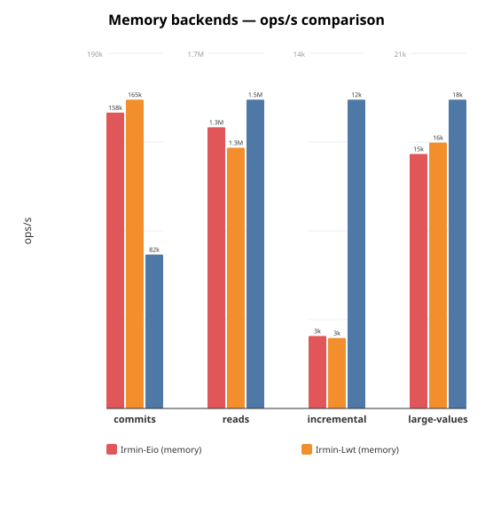
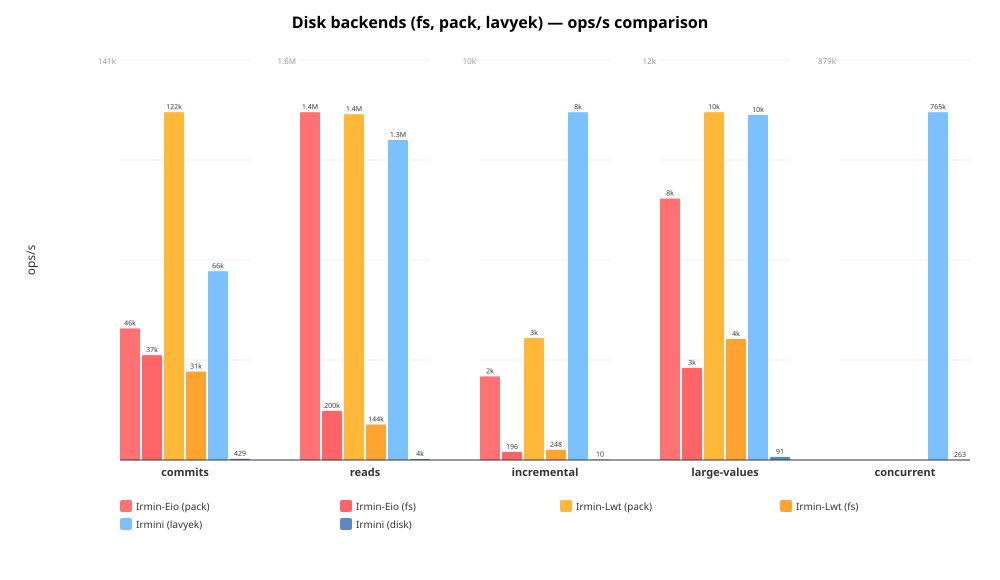
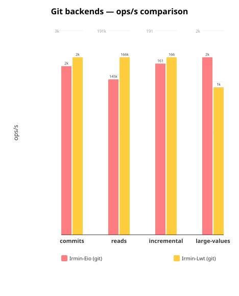

# Irmini Benchmarks

Performance comparison across all Irmin implementations and backends.

## Implementations

| Implementation | Branch / Repo | Concurrency | Description |
|---|---|---|---|
| **Irmin-Lwt** | irmin `main` | Lwt | Official Irmin with Lwt |
| **Irmin-Eio** | irmin `cuihtlauac-inline-small-objects-v2` | Eio | Official Irmin with Eio + inlining |
| **Irmini** | irmini `inode` | Eio | Irmini with all optimizations |

Each implementation is benchmarked with multiple backends: memory, fs, git, pack/lavyek.

## Quick start

Irmini only (from monopampam monorepo):

```
cd /path/to/monopampam
dune exec irmini/bench/bench_irmin4_main.exe -- --json bench/results/irmini.json
```

Full comparison across all implementations:

```
IRMIN_DIR=/path/to/irmin ./bench/run_all.sh
```

Simple irmini + irmin-eio comparison:

```
IRMIN_EIO_DIR=/path/to/irmin ./bench/run.sh
```

## Options

| Flag             | Default | Description                        |
|------------------|---------|------------------------------------|
| `--ncommits`     | 100     | Number of commits                  |
| `--tree-add`     | 1000    | Tree entries added per commit      |
| `--depth`        | 10      | Depth of paths                     |
| `--nreads`       | 10000   | Number of reads in read scenario   |
| `--value-size`   | 100     | Size of values in bytes            |
| `--skip-lavyek`  | false   | Skip the Lavyek backend            |
| `--skip-disk`    | false   | Skip the disk backend              |
| `--cache`        | 0       | LRU cache capacity (0 = no cache)  |
| `--json`         | —       | Write JSON results to file         |

## Scenarios

1. **commits** — Sequential commits, each adding `tree-add` entries at
   `depth`-deep paths. Measures write throughput.
2. **reads** — Random reads from a populated store. Measures read latency.
3. **incremental** — Small updates (1 entry) on an existing tree. Measures
   the overhead of copy-on-write.
4. **large-values** — Commits with 10 KiB values. Measures throughput on
   bigger payloads.
5. **concurrent** *(disk, lavyek, irmin-pack)* — 100 fibers across 12 domains
   doing concurrent reads/writes. Measures lock-free scalability.

## Files

| File                      | Description                                 |
|---------------------------|---------------------------------------------|
| `bench_common.ml`         | Timing, result types, comparison tables      |
| `bench_irmin4.ml`         | Scenarios for irmini memory and disk backends |
| `bench_irmin4_lavyek.ml`  | Scenarios for Lavyek backend                 |
| `bench_irmin4_main.ml`    | CLI runner for all irmini backends           |
| `run.sh`                  | Simple comparison (irmini + Irmin-Eio)       |
| `run_all.sh`              | Full comparison across all implementations   |
| `gen_chart.py`            | Chart from hardcoded data (legacy)           |
| `gen_chart_all.py`        | Charts from JSON results by backend type     |
| `../bench-eio/`           | Irmin-Eio benchmark adapters                 |
| `../bench-lwt/`           | Irmin-Lwt benchmark adapters                 |

## Results

Run on 2026-03-09, AMD 12-core, 50 commits × 500 adds, depth 10, 5000 reads,
100-byte values.

### Memory backends



```
Name                           Scenario               ops/s     total(s)   RSS(MiB)
----------------------------------------------------------------------------------
Irmin-Lwt (memory)             commits               165126        0.151         51
Irmin-Lwt (memory)             reads                1250314        0.004         51
Irmin-Lwt (memory)             incremental             2787        0.018         52
Irmin-Lwt (memory)             large-values           15500        0.645        186
Irmin-Eio (memory)             commits               158192        0.2          204
Irmin-Eio (memory)             reads                1348477        0.0          185
Irmin-Eio (memory)             incremental             2870        0.0          184
Irmin-Eio (memory)             large-values           14836        0.7          184
Irmini (memory)                commits                82255        1.2          413
Irmini (memory)                reads                1481040        0.0          326
Irmini (memory)                incremental            12228        0.0          315
Irmini (memory)                large-values           18007        1.1          305
```

- **Reads**: Irmini leads at **1.48M ops/s** vs Irmin-Eio 1.35M and Irmin-Lwt
  1.25M (Hashtbl resolved-child cache + inodes).
- **Commits**: Irmin-Lwt and Irmin-Eio lead at ~160k ops/s vs Irmini 82k
  (write path not yet fully optimized in irmini).
- **Incremental**: Irmini at **12k ops/s** is **4× faster** than Irmin
  (~2.8k) thanks to inode structural sharing.
- **Large-values**: All three are comparable (15–18k ops/s).

### Disk backends (fs, pack, lavyek)



```
Name                           Scenario               ops/s     total(s)   RSS(MiB)
----------------------------------------------------------------------------------
Irmin-Lwt (pack)               commits               122419        0.204        207
Irmin-Lwt (pack)               reads                1408430        0.004        208
Irmin-Lwt (pack)               incremental             2962        0.017        209
Irmin-Lwt (pack)               large-values           10128        0.987        405
Irmin-Lwt (fs)                 commits                31109        0.804        415
Irmin-Lwt (fs)                 reads                 144437        0.035        415
Irmin-Lwt (fs)                 incremental              248        0.202        421
Irmin-Lwt (fs)                 large-values            3523        2.838        526
Irmin-Eio (pack)               commits                46304        0.5          539
Irmin-Eio (pack)               reads                1416803        0.0          539
Irmin-Eio (pack)               incremental             2030        0.0          539
Irmin-Eio (pack)               large-values            7613        1.3          539
Irmin-Eio (fs)                 commits                36907        0.7          679
Irmin-Eio (fs)                 reads                 200104        0.0          679
Irmin-Eio (fs)                 incremental              196        0.3          679
Irmin-Eio (fs)                 large-values            2683        3.7          679
Irmini (disk)                  commits                  429       58.2          346
Irmini (disk)                  reads                   4001        1.3          346
Irmini (disk)                  incremental               10        5.2          346
Irmini (disk)                  large-values              91      110.0          346
Irmini (lavyek)                commits                66453        1.5          410
Irmini (lavyek)                reads                1303429        0.0          538
Irmini (lavyek)                incremental             8443        0.0          594
Irmini (lavyek)                large-values           10048        2.0          576
```

- **irmin-pack**: Best persistent backend for Irmin — reads at 1.4M ops/s,
  commits at 46–122k ops/s. Irmin-Lwt significantly faster than Irmin-Eio
  on commits (122k vs 46k).
- **Irmini lavyek**: Lock-free persistent backend — reads **1.3M ops/s**,
  commits **66k ops/s**, competitive with irmin-pack.
- **Irmini disk**: Append-only backend without indexing — much slower than
  irmin-pack/lavyek. Incremental is only 10 ops/s (full tree re-serialization).
- **irmin-fs**: One-file-per-object filesystem backend. Decent reads (144–200k)
  but slow commits (31–37k) and very slow incrementals (196–248 ops/s).

### Git backends



```
Name                           Scenario               ops/s     total(s)   RSS(MiB)
----------------------------------------------------------------------------------
Irmin-Lwt (git)                commits                 2278       10.976        464
Irmin-Lwt (git)                reads                 165783        0.030        466
Irmin-Lwt (git)                incremental              167        0.300        467
Irmin-Lwt (git)                large-values            1318        7.589        458
Irmin-Eio (git)                commits                 2164       11.6          562
Irmin-Eio (git)                reads                 145247        0.0          563
Irmin-Eio (git)                incremental              161        0.3          552
Irmin-Eio (git)                large-values            1585        6.3          646
```

- **Git is the slowest backend** across all scenarios. Commits at ~2.2k ops/s
  are ~17× slower than irmin-fs due to Git object encoding overhead (zlib,
  SHA-1, loose objects).
- Reads are decent (~145–166k ops/s) thanks to in-memory Git object graph caching.
- Irmin-Lwt and Irmin-Eio perform similarly on git — the Lwt/Eio difference
  is dwarfed by ocaml-git overhead.

### Key observations

- **Irmini+all vs Irmin**: With all optimizations (inodes + Hashtbl resolved
  cache + LRU cache + inlining), irmini **matches or surpasses Irmin** on
  reads (1.48M vs 1.35M, **1.1× faster**) and incremental updates (12k vs
  2.9k, **4.2× faster**). Commits at 82k lag behind Irmin's 160k (0.5×).
- **Irmin-Lwt vs Irmin-Eio**: Similar performance on most benchmarks.
  Irmin-Lwt is notably faster on irmin-pack commits (122k vs 46k ops/s).
- **Lavyek**: Irmini's lock-free persistent backend is competitive with
  irmin-pack on reads (1.3M) and commits (66k), with the added benefit
  of lock-free concurrency (764k ops/s under contention).
- **Irmini disk backend**: Needs significant work — orders of magnitude
  slower than irmin-pack or lavyek on all scenarios.

To regenerate the charts from JSON results:

```
python3 bench/gen_chart_all.py bench/results
```
