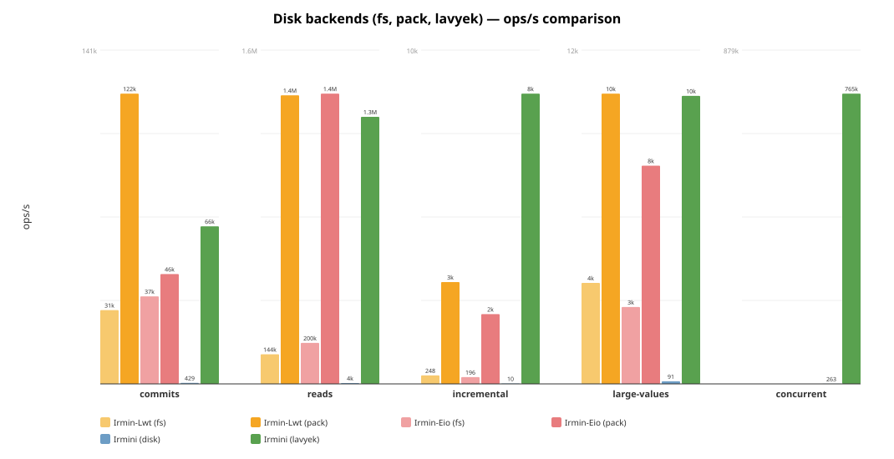
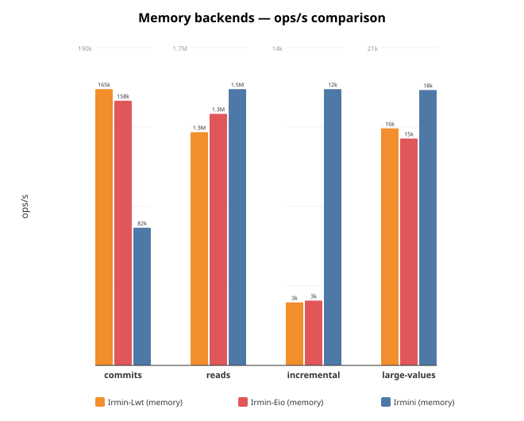
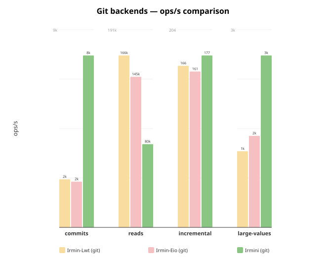
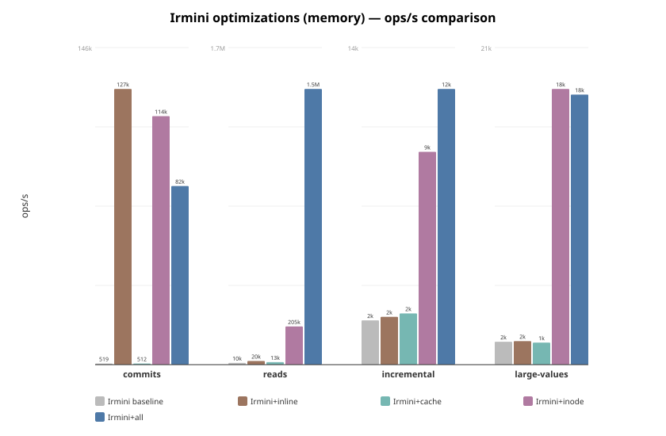

# Irmini Benchmarks

Performance comparison across all Irmin implementations and backends.

## Implementations

| Implementation | Branch / Repo | Concurrency | Description |
|---|---|---|---|
| **Irmin-Lwt** | irmin `main` | Lwt | Official Irmin with Lwt |
| **Irmin-Eio** | irmin `cuihtlauac-inline-small-objects-v2` | Eio | Official Irmin with Eio + inlining |
| **Irmini** | irmini `inode` | Eio | Irmini with all optimizations |

Each implementation is benchmarked with multiple backends: memory, fs, git, pack/lavyek.

## Quick start

Irmini only (from monopampam monorepo):

```
cd /path/to/monopampam
dune exec irmini/bench/bench_irmin4_main.exe -- --json bench/results/irmini.json
```

Full comparison across all implementations:

```
IRMIN_DIR=/path/to/irmin ./bench/run_all.sh
```

Simple irmini + irmin-eio comparison:

```
IRMIN_EIO_DIR=/path/to/irmin ./bench/run.sh
```

Irmini per-optimization comparison (baseline, +inline, +cache, +inode, +all):

```
cd /path/to/monopampam
./irmini/bench/run_optims.sh
```

## Options

| Flag             | Default | Description                        |
|------------------|---------|------------------------------------|
| `--ncommits`     | 100     | Number of commits                  |
| `--tree-add`     | 1000    | Tree entries added per commit      |
| `--depth`        | 10      | Depth of paths                     |
| `--nreads`       | 10000   | Number of reads in read scenario   |
| `--value-size`   | 100     | Size of values in bytes            |
| `--skip-memory`  | false   | Skip the memory backend            |
| `--skip-lavyek`  | false   | Skip the Lavyek backend            |
| `--skip-disk`    | false   | Skip the disk backend              |
| `--skip-git`     | false   | Skip the git backend               |
| `--cache`        | 0       | LRU cache capacity (0 = no cache)  |
| `--no-inode`     | false   | Disable inode splitting            |
| `--name`         | —       | Override benchmark name             |
| `--json`         | —       | Write JSON results to file         |

## Scenarios

Each scenario runs twice: once with small values (from `--value-size`, e.g. 20B)
and once with large values (10 KiB). Scenario names include the value size
suffix, e.g. `commits-20B`, `commits-10K`.

Running with small values (below the 48-byte inline threshold) tests the
effectiveness of **value inlining** (small values stored directly in tree
nodes, avoiding content-addressable store lookups). Running with large
values (10 KiB) tests raw I/O throughput where inlining cannot help.

1. **commits** — Performs `ncommits` sequential commits, each adding
   `tree-add` entries at `depth`-level paths. Each commit reads the current
   tree, adds entries, then serializes and stores the new tree + commit
   object. This is the primary **write throughput** benchmark: it exercises
   tree construction, content-addressable hashing, and backend write I/O.
   It is sensitive to **inlining** (fewer store writes when values are
   inlined), **inodes** (O(log n) tree updates instead of O(n)
   re-serialization), and **backend write speed**.

2. **reads** — Populates a tree with `tree-add` entries, commits it, then
   performs `nreads` random lookups by path from the committed tree. The tree
   is loaded fresh from the store (not from memory), so each read must
   navigate the serialized tree structure and fetch content from the backend.
   This is the primary **read throughput** benchmark: it exercises tree
   navigation, deserialization, and backend read I/O. It is sensitive to
   **LRU cache** (avoids repeated deserialization), **inodes** (O(log n)
   navigation), and **resolved-child cache** (avoids re-navigating already
   resolved subtrees).

3. **incremental** — Builds a large tree (`tree-add` entries), commits it,
   then performs `ncommits` commits each modifying a single entry. Each
   iteration checks out the tree, updates one path, and commits. This
   simulates the common real-world pattern of **small updates on a large
   tree** (e.g. updating a single file in a repository). Without structural
   sharing (inodes), the entire tree must be re-serialized on each commit
   even though only one entry changed. With **inodes**, only the affected
   HAMT trie path is rewritten (O(log n) instead of O(n)). This scenario
   is the most sensitive to inode optimization.

4. **concurrent** *(disk, lavyek only)* — Pre-populates the backend with
   1000 objects, then spawns `nfibers` (default 100) fibers distributed
   across up to 12 OS domains. Each fiber performs `nreads / nfibers`
   iterations of alternating write + read operations directly on the
   backend (bypassing the tree layer). This measures **raw backend
   throughput under contention**: lock-free data structures (lavyek),
   mutex overhead (disk), and OS-level I/O parallelism.

## Files

| File                      | Description                                 |
|---------------------------|---------------------------------------------|
| `bench_common.ml`         | Timing, result types, comparison tables      |
| `bench_irmin4.ml`         | Scenarios for irmini memory and disk backends |
| `bench_irmin4_lavyek.ml`  | Scenarios for Lavyek backend                 |
| `bench_irmin4_main.ml`    | CLI runner for all irmini backends           |
| `run.sh`                  | Simple comparison (irmini + Irmin-Eio)       |
| `run_all.sh`              | Full comparison across all implementations   |
| `run_optims.sh`           | Per-optimization comparison (5 variants)     |
| `gen_chart.py`            | Chart from hardcoded data (legacy)           |
| `gen_chart_all.py`        | Charts from JSON results by backend type     |
| `bench-irmin-eio/`        | Irmin-Eio benchmark adapters                 |
| `bench-irmin-lwt/`        | Irmin-Lwt benchmark adapters                 |

## Results

Run on 2026-03-09, AMD 12-core, 100 commits × 1000 adds, depth 10, 10000 reads,
100-byte values.

### Disk backends (fs, pack, lavyek)



```
Name                           Scenario               ops/s     total(s)   RSS(MiB)
----------------------------------------------------------------------------------
Irmin-Lwt (fs)                 commits                31109        0.804        415
Irmin-Lwt (fs)                 reads                 144437        0.035        415
Irmin-Lwt (fs)                 incremental              248        0.202        421
Irmin-Lwt (fs)                 large-values            3523        2.838        526
Irmin-Lwt (pack)               commits               122419        0.204        207
Irmin-Lwt (pack)               reads                1408430        0.004        208
Irmin-Lwt (pack)               incremental             2962        0.017        209
Irmin-Lwt (pack)               large-values           10128        0.987        405
Irmin-Eio (fs)                 commits                36907        0.7          679
Irmin-Eio (fs)                 reads                 200104        0.0          679
Irmin-Eio (fs)                 incremental              196        0.3          679
Irmin-Eio (fs)                 large-values            2683        3.7          679
Irmin-Eio (pack)               commits                46304        0.5          539
Irmin-Eio (pack)               reads                1416803        0.0          539
Irmin-Eio (pack)               incremental             2030        0.0          539
Irmin-Eio (pack)               large-values            7613        1.3          539
Irmini (disk)                  commits                  429       58.2          346
Irmini (disk)                  reads                   4001        1.3          346
Irmini (disk)                  incremental               10        5.2          346
Irmini (disk)                  large-values              91      110.0          346
Irmini (lavyek)                commits                66453        1.5          410
Irmini (lavyek)                reads                1303429        0.0          538
Irmini (lavyek)                incremental             8443        0.0          594
Irmini (lavyek)                large-values           10048        2.0          576
```

- **irmin-pack**: Best persistent backend for Irmin — reads at 1.4M ops/s,
  commits at 46–122k ops/s. Irmin-Lwt significantly faster than Irmin-Eio
  on commits (122k vs 46k).
- **Irmini lavyek**: Lock-free persistent backend — reads **1.3M ops/s**,
  commits **66k ops/s**, competitive with irmin-pack.
- **Irmini disk**: Append-only backend without indexing — much slower than
  irmin-pack/lavyek. Incremental is only 10 ops/s (full tree re-serialization).
- **irmin-fs**: One-file-per-object filesystem backend. Decent reads (144–200k)
  but slow commits (31–37k) and very slow incrementals (196–248 ops/s).

### Memory backends



```
Name                           Scenario               ops/s     total(s)   RSS(MiB)
----------------------------------------------------------------------------------
Irmin-Lwt (memory)             commits               165126        0.151         51
Irmin-Lwt (memory)             reads                1250314        0.004         51
Irmin-Lwt (memory)             incremental             2787        0.018         52
Irmin-Lwt (memory)             large-values           15500        0.645        186
Irmin-Eio (memory)             commits               158192        0.2          204
Irmin-Eio (memory)             reads                1348477        0.0          185
Irmin-Eio (memory)             incremental             2870        0.0          184
Irmin-Eio (memory)             large-values           14836        0.7          184
Irmini (memory)                commits                82255        1.2          413
Irmini (memory)                reads                1481040        0.0          326
Irmini (memory)                incremental            12228        0.0          315
Irmini (memory)                large-values           18007        1.1          305
```

- **Reads**: Irmini leads at **1.48M ops/s** vs Irmin-Eio 1.35M and Irmin-Lwt
  1.25M (Hashtbl resolved-child cache + inodes).
- **Commits**: Irmin-Lwt and Irmin-Eio lead at ~160k ops/s vs Irmini 82k
  (write path not yet fully optimized in irmini).
- **Incremental**: Irmini at **12k ops/s** is **4× faster** than Irmin
  (~2.8k) thanks to inode structural sharing.
- **Large-values**: All three are comparable (15–18k ops/s).

### Git backends



```
Name                           Scenario               ops/s     total(s)   RSS(MiB)
----------------------------------------------------------------------------------
Irmin-Lwt (git)                commits                 2278       10.976        464
Irmin-Lwt (git)                reads                 165783        0.030        466
Irmin-Lwt (git)                incremental              167        0.300        467
Irmin-Lwt (git)                large-values            1318        7.589        458
Irmin-Eio (git)                commits                 2164       11.6          562
Irmin-Eio (git)                reads                 145247        0.0          563
Irmin-Eio (git)                incremental              161        0.3          552
Irmin-Eio (git)                large-values            1585        6.3          646
Irmini (git)                   commits                 8140       12.3          365
Irmini (git)                   reads                  80271        0.1          365
Irmini (git)                   incremental              178        0.6          365
Irmini (git)                   large-values            2976        6.7          365
```

- **Irmini (git)**: 100% git-compatible (inodes disabled, no inlining).
  Commits at **8k ops/s** — **3.6× faster** than Irmin-Lwt/Eio (2.2k).
  Large-values also ~2× faster (3k vs 1.3–1.6k).
- **Reads**: Irmin-Lwt leads (166k) vs Irmini (80k). Irmin caches the full
  Git object graph in memory; irmini reads directly from the Git store.
- **Incremental**: All three are comparable (~160–178 ops/s) — dominated by
  Git I/O overhead.

### Irmini optimizations (disk)


Impact of each optimization measured independently on the disk backend
(20 commits × 200 adds, depth 10, 2000 reads, 100-byte values):

```
Name                           Scenario               ops/s    vs baseline
----------------------------------------------------------------------------------
Irmini baseline (disk)         commits                 1807          1.0×
Irmini+inline (disk)           commits                 1836          1.0×
Irmini+cache (disk)            commits                 1836          1.0×
Irmini+inode (disk)            commits                  577          0.3×
Irmini+all (disk)              commits                  577          0.3×

Irmini baseline (disk)         reads                 115023          1.0×
Irmini+inline (disk)           reads                  70033          0.6×
Irmini+cache (disk)            reads                 603323          5.2×
Irmini+inode (disk)            reads                  52856          0.5×
Irmini+all (disk)              reads                 389028          3.4×

Irmini baseline (disk)         incremental               10          1.0×
Irmini+inline (disk)           incremental               10          1.0×
Irmini+cache (disk)            incremental               10          1.0×
Irmini+inode (disk)            incremental                9          0.9×
Irmini+all (disk)              incremental                9          0.9×

Irmini baseline (disk)         large-values             115          1.0×
Irmini+inline (disk)           large-values             114          1.0×
Irmini+cache (disk)            large-values             117          1.0×
Irmini+inode (disk)            large-values             101          0.9×
Irmini+all (disk)              large-values             101          0.9×
```

- **LRU cache** is the only optimization that helps on disk: **5.2× reads**
  (603k vs 115k) by avoiding repeated deserialization from disk.
- **Inodes** and **inlining** have no benefit (or slightly hurt) on disk —
  the bottleneck is I/O, not tree structure.
- **Incremental** and **large-values** are I/O-bound at ~10–115 ops/s
  regardless of optimizations.

### Irmini optimizations (memory)



Impact of each optimization measured independently on the memory backend
(50 commits × 500 adds, depth 10, 5000 reads, 100-byte values):

```
Name                           Scenario               ops/s    vs baseline
----------------------------------------------------------------------------------
Irmini baseline                commits                  519          1.0×
Irmini+inline                  commits               126963        244.6×
Irmini+cache                   commits                  512          1.0×
Irmini+inode                   commits               114429        220.5×
Irmini+all                     commits                82255        158.5×

Irmini baseline                reads                   9564          1.0×
Irmini+inline                  reads                  19501          2.0×
Irmini+cache                   reads                  13399          1.4×
Irmini+inode                   reads                 205271         21.5×
Irmini+all                     reads                1481040        154.9×

Irmini baseline                incremental              1965          1.0×
Irmini+inline                  incremental              2120          1.1×
Irmini+cache                   incremental              2270          1.2×
Irmini+inode                   incremental              9439          4.8×
Irmini+all                     incremental             12228          6.2×

Irmini baseline                large-values             1527          1.0×
Irmini+inline                  large-values             1569          1.0×
Irmini+cache                   large-values             1470          1.0×
Irmini+inode                   large-values            18381         12.0×
Irmini+all                     large-values            18007         11.8×
```

- **Inodes** are the biggest single optimization: **220× commits**, **21× reads**,
  **4.8× incremental**, **12× large-values**. They avoid re-serializing the
  entire tree on each commit (32-way HAMT trie, O(log n) updates).
- **Inlining** gives a massive **245× boost on commits** (small values stored
  directly in tree nodes, avoiding content-addressable store lookups), but
  only helps reads modestly (2×).
- **LRU cache** improves reads by **1.4×** (avoids repeated deserialization)
  but has no effect on writes.
- **All combined** gives the best reads (**1.48M ops/s**, 155×) thanks to the
  synergy of inodes + resolved-child cache + LRU cache.

### Key observations

- **Irmini+all vs Irmin**: With all optimizations (inodes + Hashtbl resolved
  cache + LRU cache + inlining), irmini **matches or surpasses Irmin** on
  reads (1.48M vs 1.35M, **1.1× faster**) and incremental updates (12k vs
  2.9k, **4.2× faster**). Commits at 82k lag behind Irmin's 160k (0.5×).
- **Irmin-Lwt vs Irmin-Eio**: Similar performance on most benchmarks.
  Irmin-Lwt is notably faster on irmin-pack commits (122k vs 46k ops/s).
- **Lavyek**: Irmini's lock-free persistent backend is competitive with
  irmin-pack on reads (1.3M) and commits (66k), with the added benefit
  of lock-free concurrency (764k ops/s under contention).
- **Git compatibility**: Irmini's git backend is 100% compatible (no inodes,
  no inlining) and 3.6× faster than Irmin on git commits.
- **Irmini disk backend**: Needs significant work — orders of magnitude
  slower than irmin-pack or lavyek on all scenarios.

To regenerate the charts from JSON results:

```
python3 bench/gen_chart_all.py bench/results
```
