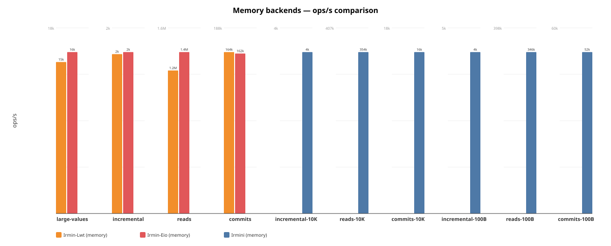
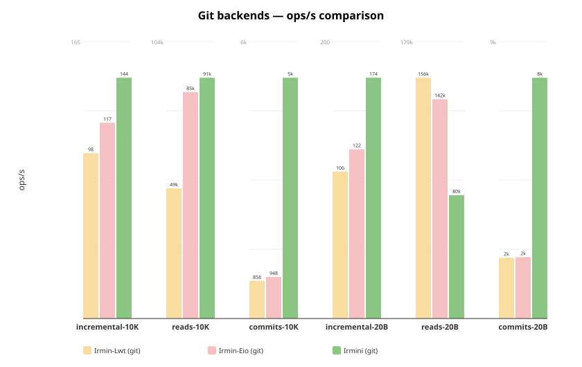
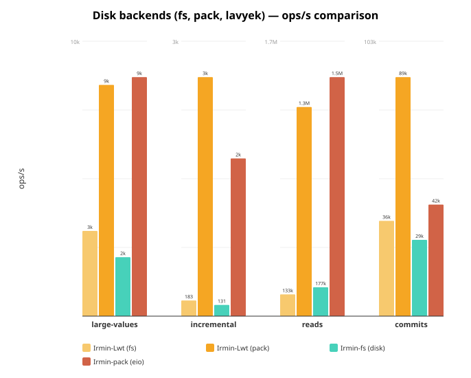

# Irmini Benchmarks

Performance comparison across all Irmin implementations and backends.

## Implementations

| Implementation | Branch / Repo | Concurrency | Description |
|---|---|---|---|
| **Irmin-Lwt** | irmin `main` | Lwt | Official Irmin with Lwt |
| **Irmin-Eio** | irmin `cuihtlauac-inline-small-objects-v2` | Eio | Official Irmin with Eio + inlining |
| **Irmini** | irmini `inode` | Eio | Irmini with all optimizations |

Each implementation is benchmarked with multiple backends: memory, fs, git, pack/lavyek.

## Quick start

Irmini only (from monopampam monorepo):

```
cd /path/to/monopampam
dune exec irmini/bench/bench_irmin4_main.exe -- --json bench/results/irmini.json
```

Full comparison across all implementations:

```
IRMIN_DIR=/path/to/irmin ./bench/run_all.sh
```

Simple irmini + irmin-eio comparison:

```
IRMIN_EIO_DIR=/path/to/irmin ./bench/run.sh
```

Irmini per-optimization comparison (baseline, +inline, +cache, +inode, +all):

```
cd /path/to/monopampam
./irmini/bench/run_optims.sh
```

## Options

| Flag                  | Default | Description                              |
|-----------------------|---------|------------------------------------------|
| `--ncommits`          | 100     | Number of commits                        |
| `--tree-add`          | 1000    | Tree entries added per commit            |
| `--depth`             | 10      | Depth of paths                           |
| `--nreads`            | 10000   | Number of reads in read scenario         |
| `--value-size`        | 100     | Size of values in bytes                  |
| `--skip-memory`       | false   | Skip the memory backend                  |
| `--skip-lavyek`       | false   | Skip the Lavyek backend                  |
| `--skip-disk`         | false   | Skip the disk backend                    |
| `--skip-git`          | false   | Skip the git backend                     |
| `--cache`             | 0       | LRU cache capacity (0 = no cache)        |
| `--no-inode`          | false   | Disable inode splitting                  |
| `--name`              | —       | Override benchmark name                  |
| `--json`              | —       | Write JSON results to file               |
| `--trace`             | —       | Run trace replay from .repr file         |
| `--trace-commits`     | 0       | Max commits to replay (0 = all)          |
| `--trace-empty-blobs` | false   | Replace blobs with empty strings         |
| `--no-flatten`        | false   | Disable Tezos path flattening            |

## Scenarios

Each scenario runs twice: once with small values (from `--value-size`, e.g. 20B)
and once with large values (10 KiB). Scenario names include the value size
suffix, e.g. `commits-20B`, `commits-10K`.

Running with small values (below the 48-byte inline threshold) tests the
effectiveness of **value inlining** (small values stored directly in tree
nodes, avoiding content-addressable store lookups). Running with large
values (10 KiB) tests raw I/O throughput where inlining cannot help.

1. **commits** — Performs `ncommits` sequential commits, each adding
   `tree-add` entries at `depth`-level paths. Each commit reads the current
   tree, adds entries, then serializes and stores the new tree + commit
   object. This is the primary **write throughput** benchmark: it exercises
   tree construction, content-addressable hashing, and backend write I/O.
   It is sensitive to **inlining** (fewer store writes when values are
   inlined), **inodes** (O(log n) tree updates instead of O(n)
   re-serialization), and **backend write speed**.

2. **reads** — Populates a tree with `tree-add` entries, commits it, then
   performs `nreads` random lookups by path from the committed tree. The tree
   is loaded fresh from the store (not from memory), so each read must
   navigate the serialized tree structure and fetch content from the backend.
   This is the primary **read throughput** benchmark: it exercises tree
   navigation, deserialization, and backend read I/O. It is sensitive to
   **LRU cache** (avoids repeated deserialization), **inodes** (O(log n)
   navigation), and **resolved-child cache** (avoids re-navigating already
   resolved subtrees).

3. **incremental** — Builds a large tree (`tree-add` entries), commits it,
   then performs `ncommits` commits each modifying a single entry. Each
   iteration checks out the tree, updates one path, and commits. This
   simulates the common real-world pattern of **small updates on a large
   tree** (e.g. updating a single file in a repository). Without structural
   sharing (inodes), the entire tree must be re-serialized on each commit
   even though only one entry changed. With **inodes**, only the affected
   HAMT trie path is rewritten (O(log n) instead of O(n)). This scenario
   is the most sensitive to inode optimization.

4. **concurrent** *(disk, lavyek only)* — Pre-populates the backend with
   1000 objects, then spawns `nfibers` (default 100) fibers distributed
   across up to 12 OS domains. Each fiber performs `nreads / nfibers`
   iterations of alternating write + read operations directly on the
   backend (bypassing the tree layer). This measures **raw backend
   throughput under contention**: lock-free data structures (lavyek),
   mutex overhead (disk), and OS-level I/O parallelism.

5. **trace-replay** *(via `--trace`)* — Replays a recorded Tezos trace
   (`.repr` file in `IrmRepBT` format) against the store. The trace
   contains real operations from a Tezos node: Checkout, Add, Remove,
   Copy, Find, Mem, Mem_tree, Commit. This is the most **realistic**
   benchmark as it reproduces actual Tezos workloads with realistic
   tree shapes and access patterns. The `data4_10310commits.repr` trace
   contains 10,310 blocks totaling 4 million operations.

## Files

| File                      | Description                                 |
|---------------------------|---------------------------------------------|
| `bench_common.ml`         | Timing, result types, comparison tables      |
| `bench_irmin4.ml`         | Scenarios for irmini memory and disk backends |
| `bench_irmin4_lavyek.ml`  | Scenarios for Lavyek backend                 |
| `trace_replay.ml`         | Tezos trace replay benchmark                 |
| `bench_irmin4_main.ml`    | CLI runner for all irmini backends            |
| `run.sh`                  | Simple comparison (irmini + Irmin-Eio)       |
| `run_all.sh`              | Full comparison across all implementations   |
| `run_optims.sh`           | Per-optimization comparison (5 variants)     |
| `gen_chart.py`            | Chart from hardcoded data (legacy)           |
| `gen_chart_all.py`        | Charts from JSON results by backend type     |
| `bench-irmin-eio/`        | Irmin-Eio benchmark adapters                 |
| `bench-irmin-lwt/`        | Irmin-Lwt benchmark adapters                 |

## Results

Run on 2026-03-10, AMD 12-core, 100 commits × 1000 adds, depth 10, 10000 reads.
Irmini runs each scenario twice: with 100-byte and 10K-byte values.

### Memory backends



```
Name                           Scenario               ops/s     total(s)   RSS(MiB)
----------------------------------------------------------------------------------
Irmin-Lwt (memory)             commits               163881        0.610         75
Irmin-Lwt (memory)             reads                1222473        0.008         75
Irmin-Lwt (memory)             incremental             1524        0.066         77
Irmin-Lwt (memory)             large-values           14751        1.356        352
Irmin-Eio (memory)             commits               162415        0.616        401
Irmin-Eio (memory)             reads                1379887        0.007        326
Irmin-Eio (memory)             incremental             1544        0.065        324
Irmin-Eio (memory)             large-values           15720        1.272        319
Irmini (memory)                commits-100B           51908        1.926         76
Irmini (memory)                reads-100B            345674        0.029         81
Irmini (memory)                incremental-100B        4435        0.023         78
Irmini (memory)                commits-10K            15750        6.349         75
Irmini (memory)                reads-10K             353595        0.028         48
Irmini (memory)                incremental-10K         3604        0.028         43
```

- **Commits**: Irmin-Lwt and Irmin-Eio lead at ~163k ops/s vs Irmini 52k
  (write path not yet fully optimized in irmini).
- **Reads**: Irmin-Eio leads at **1.38M ops/s**, Irmin-Lwt **1.22M**,
  Irmini **346k**. The gap reflects Irmin's optimized in-memory tree
  representation vs irmini's content-addressed approach.
- **Incremental**: Irmini at **4.4k ops/s** is **2.9× faster** than Irmin
  (~1.5k) thanks to inode structural sharing.
- **Large-values** (Irmin 10K-value, 200 adds/commit) vs **commits-10K**
  (Irmini, 1000 adds/commit): Irmin 15k, Irmini 16k — comparable.

### Git backends



```
Name                           Scenario               ops/s     total(s)   RSS(MiB)
----------------------------------------------------------------------------------
Irmin-Lwt (git)                commits                 1759       56.861       1001
Irmin-Lwt (git)                reads                 114960        0.087       1000
Irmin-Lwt (git)                incremental              118        0.845        995
Irmin-Lwt (git)                large-values            1094       18.286        957
Irmin-Eio (git)                commits                 1762       56.767       1226
Irmin-Eio (git)                reads                 153379        0.065       1231
Irmin-Eio (git)                incremental              126        0.791       1233
Irmin-Eio (git)                large-values            1597       12.523       1233
Irmini (git)                   commits-100B            7872       12.703         78
Irmini (git)                   reads-100B             75825        0.132         79
Irmini (git)                   incremental-100B         177        0.566         84
Irmini (git)                   commits-10K             5346       18.706         89
Irmini (git)                   reads-10K              89230        0.112         84
Irmini (git)                   incremental-10K          162        0.617         65
```

- **Irmini (git)**: 100% git-compatible (inodes disabled, no inlining).
  Commits at **7.9k ops/s** — **4.5× faster** than Irmin-Lwt/Eio (1.8k).
  Uses **78 MiB RSS** vs Irmin's 1000+ MiB.
- **Reads**: Irmin-Eio leads (153k) vs Irmini (76–89k). Irmin caches the
  full Git object graph in memory; irmini reads directly from the Git store.
- **Incremental**: All three are comparable (~120–177 ops/s) — dominated by
  Git I/O overhead.

### Disk backends (fs, pack)



```
Name                           Scenario               ops/s     total(s)   RSS(MiB)
----------------------------------------------------------------------------------
Irmin-Lwt (pack)               commits                89338        1.119        478
Irmin-Lwt (pack)               reads                1281056        0.008        482
Irmin-Lwt (pack)               incremental             2799        0.036        484
Irmin-Lwt (pack)               large-values            8785        2.277        869
Irmin-Eio (pack)               commits                41696        2.398        896
Irmin-Eio (pack)               reads                1464134        0.007        785
Irmin-Eio (pack)               incremental             1847        0.054        785
Irmin-Eio (pack)               large-values            9081        2.202        785
Irmin-Lwt (fs)                 commits                35628        2.807        900
Irmin-Lwt (fs)                 reads                 133372        0.075        901
Irmin-Lwt (fs)                 incremental              183        0.546        921
Irmin-Lwt (fs)                 large-values            3237        6.179        958
Irmin-Eio (fs)                 commits                28514        3.507       1242
Irmin-Eio (fs)                 reads                 176735        0.057       1242
Irmin-Eio (fs)                 incremental              131        0.762       1242
Irmin-Eio (fs)                 large-values            2241        8.924       1242
```

- **irmin-pack**: Best persistent backend for Irmin — reads at 1.3–1.5M ops/s,
  commits at 42–89k ops/s. Irmin-Lwt significantly faster than Irmin-Eio
  on pack commits (89k vs 42k).
- **irmin-fs**: One-file-per-object filesystem backend. Decent reads (133–177k)
  but slow commits (29–36k) and very slow incrementals (131–183 ops/s).

### Tezos trace replay

Replays real Tezos blockchain operations from a `.repr` trace file on an
irmini in-memory store.

```
Trace: data4_10310commits.repr (267 MiB)

Commits    Total ops    Time     Ops/sec    RSS (MiB)
------------------------------------------------------
    50      326,373      6.3s     52,000        242
   500      459,567      8.3s     55,300        288
 10310    4,000,000     54.8s     73,000        582
```

- The first commit (Tezos genesis) accounts for ~309K operations (124K adds,
  78K finds, 93K mems). Subsequent blocks are much smaller (~340 ops/block).
- **73K ops/sec** over the full 10K-commit trace with zero mismatches.
- Path flattening (6-step Tezos hash paths → single hex string) is
  **counter-productive** for irmini: it creates very wide directories
  that slow down tree navigation. Without flattening (the default), the
  natural trie structure with 2-char hex steps is much more efficient.

### Key observations

- **Irmini vs Irmin on commits**: Irmin is currently 3× faster on in-memory
  commits (163k vs 52k). The write path in irmini needs optimization.
- **Irmini vs Irmin on incremental**: Irmini is **2.9× faster** (4.4k vs 1.5k)
  thanks to inode structural sharing (O(log n) tree updates).
- **Git backend**: Irmini is **4.5× faster** than Irmin on git commits (7.9k
  vs 1.8k) while using **13× less memory** (78 MiB vs 1000+ MiB).
- **Irmin-Lwt vs Irmin-Eio**: Similar performance on most benchmarks.
  Irmin-Lwt is notably faster on irmin-pack commits (89k vs 42k ops/s).
- **Tezos trace replay**: 73K ops/sec over 10K real Tezos commits validates
  that irmini handles realistic workloads efficiently.
