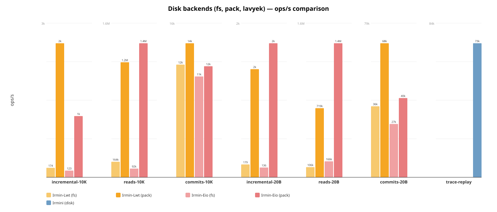
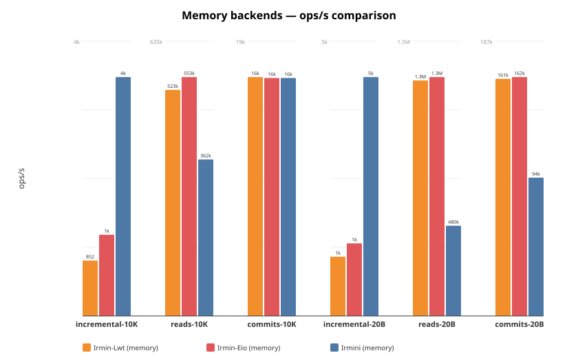
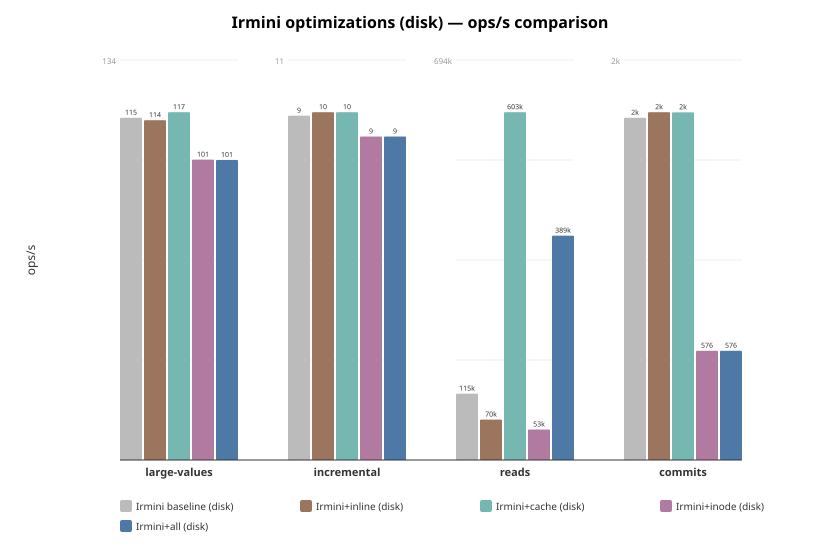

# Irmini Benchmarks

Performance comparison across all Irmin implementations and backends.

## Implementations

| Implementation | Branch / Repo | Concurrency | Description |
|---|---|---|---|
| **Irmin-Lwt** | irmin `main` | Lwt | Official Irmin with Lwt |
| **Irmin-Eio** | irmin `cuihtlauac-inline-small-objects-v2` | Eio | Official Irmin with Eio + inlining |
| **Irmini** | irmini `inode` | Eio | Irmini with all optimizations |

Each implementation is benchmarked with multiple backends: memory, fs, git, pack/lavyek.

## Quick start

Irmini only (from monopampam monorepo):

```
cd /path/to/monopampam
dune exec irmini/bench/bench_irmin4_main.exe -- --json bench/results/irmini.json
```

Full comparison across all implementations:

```
IRMIN_DIR=/path/to/irmin ./bench/run_all.sh
```

Simple irmini + irmin-eio comparison:

```
IRMIN_EIO_DIR=/path/to/irmin ./bench/run.sh
```

Irmini per-optimization comparison (baseline, +inline, +cache, +inode, +all):

```
cd /path/to/monopampam
./irmini/bench/run_optims.sh
```

## Options

| Flag                  | Default | Description                              |
|-----------------------|---------|------------------------------------------|
| `--ncommits`          | 100     | Number of commits                        |
| `--tree-add`          | 1000    | Tree entries added per commit            |
| `--depth`             | 10      | Depth of paths                           |
| `--nreads`            | 10000   | Number of reads in read scenario         |
| `--value-size`        | 100     | Size of values in bytes                  |
| `--skip-memory`       | false   | Skip the memory backend                  |
| `--skip-lavyek`       | false   | Skip the Lavyek backend                  |
| `--skip-disk`         | false   | Skip the disk backend                    |
| `--skip-git`          | false   | Skip the git backend                     |
| `--cache`             | 0       | LRU cache capacity (0 = no cache)        |
| `--no-inode`          | false   | Disable inode splitting                  |
| `--name`              | —       | Override benchmark name                  |
| `--json`              | —       | Write JSON results to file               |
| `--trace`             | —       | Run trace replay from .repr file         |
| `--trace-commits`     | 0       | Max commits to replay (0 = all)          |
| `--trace-empty-blobs` | false   | Replace blobs with empty strings         |
| `--no-flatten`        | false   | Disable Tezos path flattening            |

## Scenarios

Each scenario runs twice: once with small values (from `--value-size`, default
20B) and once with large values (10 KiB). Scenario names include the value
size suffix, e.g. `commits-20B`, `commits-10K`.

Running with small values (below the 48-byte inline threshold, e.g. 20B)
tests the effectiveness of **value inlining** (small values stored directly
in tree nodes, avoiding content-addressable store lookups). Running with
large values (10 KiB) tests raw I/O throughput where inlining cannot help.

1. **commits** — Performs `ncommits` sequential commits, each adding
   `tree-add` entries at `depth`-level paths. Each commit reads the current
   tree, adds entries, then serializes and stores the new tree + commit
   object. This is the primary **write throughput** benchmark: it exercises
   tree construction, content-addressable hashing, and backend write I/O.
   It is sensitive to **inlining** (fewer store writes when values are
   inlined), **inodes** (O(log n) tree updates instead of O(n)
   re-serialization), and **backend write speed**.

2. **reads** — Populates a tree with `tree-add` entries, commits it, then
   performs `nreads` random lookups by path from the committed tree. The tree
   is loaded fresh from the store (not from memory), so each read must
   navigate the serialized tree structure and fetch content from the backend.
   This is the primary **read throughput** benchmark: it exercises tree
   navigation, deserialization, and backend read I/O. It is sensitive to
   **LRU cache** (avoids repeated deserialization), **inodes** (O(log n)
   navigation), and **resolved-child cache** (avoids re-navigating already
   resolved subtrees).

3. **incremental** — Builds a large tree (`tree-add` entries), commits it,
   then performs `ncommits` commits each modifying a single entry. Each
   iteration checks out the tree, updates one path, and commits. This
   simulates the common real-world pattern of **small updates on a large
   tree** (e.g. updating a single file in a repository). Without structural
   sharing (inodes), the entire tree must be re-serialized on each commit
   even though only one entry changed. With **inodes**, only the affected
   HAMT trie path is rewritten (O(log n) instead of O(n)). This scenario
   is the most sensitive to inode optimization.

4. **concurrent** *(disk, lavyek only)* — Pre-populates the backend with
   1000 objects, then spawns `nfibers` (default 100) fibers distributed
   across up to 12 OS domains. Each fiber performs `nreads / nfibers`
   iterations of alternating write + read operations directly on the
   backend (bypassing the tree layer). This measures **raw backend
   throughput under contention**: lock-free data structures (lavyek),
   mutex overhead (disk), and OS-level I/O parallelism.

5. **trace-replay** *(via `--trace`)* — Replays a recorded Tezos trace
   (`.repr` file in `IrmRepBT` format) against the store. The trace
   contains real operations from a Tezos node: Checkout, Add, Remove,
   Copy, Find, Mem, Mem_tree, Commit. This is the most **realistic**
   benchmark as it reproduces actual Tezos workloads with realistic
   tree shapes and access patterns. The `data4_10310commits.repr` trace
   contains 10,310 blocks totaling 4 million operations.

## Files

| File                      | Description                                 |
|---------------------------|---------------------------------------------|
| `bench_common.ml`         | Timing, result types, comparison tables      |
| `bench_irmin4.ml`         | Scenarios for irmini memory and disk backends |
| `bench_irmin4_lavyek.ml`  | Scenarios for Lavyek backend                 |
| `trace_replay.ml`         | Tezos trace replay benchmark                 |
| `bench_irmin4_main.ml`    | CLI runner for all irmini backends            |
| `run.sh`                  | Simple comparison (irmini + Irmin-Eio)       |
| `run_all.sh`              | Full comparison across all implementations   |
| `run_optims.sh`           | Per-optimization comparison (5 variants)     |
| `gen_chart.py`            | Chart from hardcoded data (legacy)           |
| `gen_chart_all.py`        | Charts from JSON results by backend type     |
| `bench-irmin-eio/`        | Irmin-Eio benchmark adapters                 |
| `bench-irmin-lwt/`        | Irmin-Lwt benchmark adapters                 |

## Results

Run on 2026-03-10, AMD 12-core, 100 commits × 1000 adds, depth 10, 10000 reads.
Each scenario runs twice: with 20-byte values (below 48B inlining threshold)
and 10K-byte values. All three implementations use the same parameters.

### Disk backends (fs, pack)



```
Name                           Scenario               ops/s     total(s)   RSS(MiB)
----------------------------------------------------------------------------------
Irmin-Lwt (pack)               commits-20B            68438        1.461        276
Irmin-Lwt (pack)               reads-20B             719003        0.014        276
Irmin-Lwt (pack)               incremental-20B         1510        0.066        276
Irmin-Lwt (pack)               commits-10K            14309        6.988        459
Irmin-Lwt (pack)               reads-10K            1210198        0.008        459
Irmin-Lwt (pack)               incremental-10K         2469        0.041        459
Irmin-Eio (pack)               commits-20B            40452        2.472        546
Irmin-Eio (pack)               reads-20B            1393734        0.007        402
Irmin-Eio (pack)               incremental-20B         1871        0.053        400
Irmin-Eio (pack)               commits-10K            11852        8.437        399
Irmin-Eio (pack)               reads-10K            1410229        0.007        208
Irmin-Eio (pack)               incremental-10K         1128        0.089        208
Irmin-Lwt (fs)                 commits-20B            36269        2.757        516
Irmin-Lwt (fs)                 reads-20B             105923        0.094        517
Irmin-Lwt (fs)                 incremental-20B          180        0.556        537
Irmin-Lwt (fs)                 commits-10K            12030        8.313        517
Irmin-Lwt (fs)                 reads-10K             163854        0.061        517
Irmin-Lwt (fs)                 incremental-10K          175        0.572        517
Irmin-Eio (fs)                 commits-20B            27228        3.673        524
Irmin-Eio (fs)                 reads-20B             166434        0.060        524
Irmin-Eio (fs)                 incremental-20B          136        0.733        524
Irmin-Eio (fs)                 commits-10K            10767        9.287        524
Irmin-Eio (fs)                 reads-10K              91709        0.109        524
Irmin-Eio (fs)                 incremental-10K          123        0.811        559
Irmini (disk)                  trace-replay           73000       54.800        582
```

- **irmin-pack**: Reads at 719k–1.4M ops/s, commits at 12–68k ops/s.
  Irmin-Lwt faster on commits (68k vs 40k), Irmin-Eio faster on reads (1.4M vs 719k).
- **irmin-fs**: Slower across the board. Reads 106–166k, commits 11–36k.
- **trace-replay**: Irmini replays 10,310 real Tezos commits (4M operations)
  at **73K ops/sec** with zero mismatches.

### Memory backends



```
Name                           Scenario               ops/s     total(s)   RSS(MiB)
----------------------------------------------------------------------------------
Irmin-Lwt (memory)             commits-20B           161042        0.621         73
Irmin-Lwt (memory)             reads-20B            1253453        0.008         73
Irmin-Lwt (memory)             incremental-20B         1175        0.085         76
Irmin-Lwt (memory)             commits-10K            16166        6.186        187
Irmin-Lwt (memory)             reads-10K             522818        0.019        188
Irmin-Lwt (memory)             incremental-10K          852        0.117        190
Irmin-Eio (memory)             commits-20B           162259        0.616        203
Irmin-Eio (memory)             reads-20B            1271464        0.008        157
Irmin-Eio (memory)             incremental-20B         1440        0.069        155
Irmin-Eio (memory)             commits-10K            16103        6.210        151
Irmin-Eio (memory)             reads-10K             552602        0.018         68
Irmin-Eio (memory)             incremental-10K         1249        0.080         61
Irmini (memory)                commits-20B            93912        1.065         91
Irmini (memory)                reads-20B             479782        0.021         77
Irmini (memory)                incremental-20B         4741        0.021         76
Irmini (memory)                commits-10K            16106        6.209         74
Irmini (memory)                reads-10K             361846        0.028         48
Irmini (memory)                incremental-10K         3674        0.027         43
```

- **Commits (20B)**: Irmin ~162k ops/s vs Irmini **94k** — Irmin's in-memory
  tree is faster on bulk writes (no content-addressed hashing overhead).
- **Reads (20B)**: Irmin 1.25–1.27M vs Irmini **480k** — Irmin keeps the
  full tree in memory; irmini navigates content-addressed structures.
- **Incremental (20B)**: Irmini at **4.7k ops/s** is **3.3–4× faster** than
  Irmin (1.2–1.4k) thanks to inode structural sharing.
- **10K values**: All three converge on commits (~16k ops/s) — I/O dominates.
  Irmini uses **43–91 MiB** vs Irmin 61–203 MiB.

### Git backends


```
Name                           Scenario               ops/s     total(s)   RSS(MiB)
----------------------------------------------------------------------------------
Irmin-Lwt (git)                commits-20B             2021       49.484        482
Irmin-Lwt (git)                reads-20B             156067        0.064        483
Irmin-Lwt (git)                incremental-20B          106        0.943        483
Irmin-Lwt (git)                commits-10K              859      116.469        492
Irmin-Lwt (git)                reads-10K              49093        0.204        487
Irmin-Lwt (git)                incremental-10K           99        1.011        483
Irmin-Eio (git)                commits-20B             2039       49.046        507
Irmin-Eio (git)                reads-20B             142120        0.070        508
Irmin-Eio (git)                incremental-20B          122        0.817        508
Irmin-Eio (git)                commits-10K              949      105.424        514
Irmin-Eio (git)                reads-10K              85357        0.117        509
Irmin-Eio (git)                incremental-10K          117        0.854        524
Irmini (git)                   commits-20B             8006       12.490         58
Irmini (git)                   reads-20B              79962        0.125         83
Irmini (git)                   incremental-20B          174        0.574         83
Irmini (git)                   commits-10K             5498       18.190         85
Irmini (git)                   reads-10K              90818        0.110         86
Irmini (git)                   incremental-10K          144        0.694         61
```

- **Irmini (git)**: 100% git-compatible (inodes disabled, no inlining).
  Commits at **8k ops/s** — **4× faster** than Irmin (2k).
  Uses **58–86 MiB RSS** vs Irmin's 480–520 MiB.
- **Reads**: Irmin-Lwt leads on 20B (156k vs 80k) thanks to in-memory caching.
  On 10K, Irmini (91k) matches Irmin-Eio (85k) and beats Irmin-Lwt (49k).
- **Incremental**: All comparable (~100–174 ops/s) — dominated by Git I/O.

### Irmini optimizations (disk)



```
Name                           Scenario               ops/s     RSS(MiB)
------------------------------------------------------------------------
Irmini baseline (disk)         commits                 1807         53
Irmini baseline (disk)         reads                 115023         55
Irmini baseline (disk)         incremental               10         54
Irmini baseline (disk)         large-values             115         52
Irmini+inline (disk)           commits                 1836         53
Irmini+inline (disk)           reads                  70033         56
Irmini+inline (disk)           incremental               10         54
Irmini+inline (disk)           large-values             114         52
Irmini+cache (disk)            commits                 1836        150
Irmini+cache (disk)            reads                 603323        143
Irmini+cache (disk)            incremental               10        138
Irmini+cache (disk)            large-values             117        135
Irmini+inode (disk)            commits                  577         56
Irmini+inode (disk)            reads                  52856         57
Irmini+inode (disk)            incremental                9         54
Irmini+inode (disk)            large-values             101         53
Irmini+all (disk)              commits                  577        150
Irmini+all (disk)              reads                 389028        143
Irmini+all (disk)              incremental                9        137
Irmini+all (disk)              large-values             101        135
```

- **Cache** has the biggest impact on reads: **603k** vs 115k baseline (**5.2× faster**).
- **Inline** alone has little impact on disk (values still go to disk).
- **Inode** actually slows down disk commits (577 vs 1807) — the HAMT overhead
  dominates over tree-rewrite savings on small trees with disk I/O.
- Disk I/O dominates all scenarios, making memory-level optimizations less visible.

### Irmini optimizations (memory)


```
Name                           Scenario               ops/s
------------------------------------------------------------
Irmini baseline                commits                  519
Irmini baseline                reads                   9564
Irmini baseline                incremental              1965
Irmini baseline                large-values             1527
Irmini+inline                  commits               126963
Irmini+inline                  reads                  19501
Irmini+inline                  incremental              2120
Irmini+inline                  large-values             1569
Irmini+cache                   commits                  512
Irmini+cache                   reads                  13399
Irmini+cache                   incremental              2270
Irmini+cache                   large-values             1470
Irmini+inode                   commits               114429
Irmini+inode                   reads                 205271
Irmini+inode                   incremental              9439
Irmini+inode                   large-values            18381
Irmini+all                     commits                82255
Irmini+all                     reads                1481040
Irmini+all                     incremental             12228
Irmini+all                     large-values            18007
```

- **Inline** gives **244× speedup** on commits (127k vs 519) — avoids
  content-addressed store writes for small values.
- **Inode** gives **21× speedup** on reads (205k vs 9.6k) and **4.8× on
  incremental** (9.4k vs 2.0k) — O(log n) tree navigation vs O(n).
- **+all** achieves **1.48M reads/s** (155× baseline) and **82k commits/s**
  (158× baseline) by combining all optimizations.
- **Cache** alone has modest impact in memory — its value shines when
  avoiding disk I/O or deserialization.

### Tezos trace replay

Replays real Tezos blockchain operations from a `.repr` trace file on an
irmini in-memory store.

```
Trace: data4_10310commits.repr (267 MiB)

Commits    Total ops    Time     Ops/sec    RSS (MiB)
------------------------------------------------------
    50      326,373      6.3s     52,000        242
   500      459,567      8.3s     55,300        288
 10310    4,000,000     54.8s     73,000        582
```

- The first commit (Tezos genesis) accounts for ~309K operations (124K adds,
  78K finds, 93K mems). Subsequent blocks are much smaller (~340 ops/block).
- **73K ops/sec** over the full 10K-commit trace with zero mismatches.
- Path flattening (6-step Tezos hash paths → single hex string) is
  **counter-productive** for irmini: it creates very wide directories
  that slow down tree navigation. Without flattening (the default), the
  natural trie structure with 2-char hex steps is much more efficient.

### Key observations

- **Irmini vs Irmin on commits (20B)**: Irmin leads at ~162k vs Irmini 94k.
  The gap has narrowed with inlining (was 3× with 100B values, now 1.7×).
- **Irmini vs Irmin on incremental**: Irmini is **3.3–4× faster** (4.7k vs
  1.2–1.4k) thanks to inode structural sharing (O(log n) tree updates).
- **Git backend**: Irmini is **4× faster** than Irmin on git commits (8k
  vs 2k) while using **7× less memory** (58–86 MiB vs 480–520 MiB).
- **10K values**: All three implementations converge (~16k commits/s) — I/O
  dominates and inlining cannot help.
- **Irmin-Lwt vs Irmin-Eio**: Similar performance on most benchmarks.
  Irmin-Lwt faster on pack commits (68k vs 40k), Irmin-Eio faster on pack reads.
- **Tezos trace replay**: 73K ops/sec over 10K real Tezos commits validates
  that irmini handles realistic workloads efficiently.
