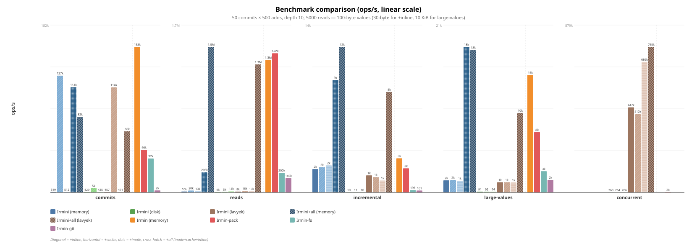
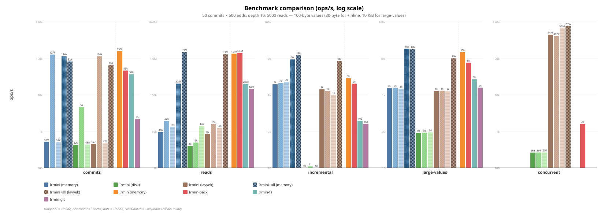

# Irmini Benchmarks

Performance comparison of irmini backends (memory, disk, lavyek) and
optionally the official Irmin-Eio (memory, irmin-pack, irmin-fs, irmin-git).

## Quick start

Build and run from the monopampam monorepo:

```
cd /path/to/monopampam
dune exec irmini/bench/bench_irmin4_main.exe
```

Or use the full comparison script (requires an Irmin-Eio checkout):

```
IRMIN_EIO_DIR=/path/to/irmin ./bench/run.sh
```

## Options

| Flag             | Default | Description                        |
|------------------|---------|------------------------------------|
| `--ncommits`     | 100     | Number of commits                  |
| `--tree-add`     | 1000    | Tree entries added per commit      |
| `--depth`        | 10      | Depth of paths                     |
| `--nreads`       | 10000   | Number of reads in read scenario   |
| `--value-size`   | 100     | Size of values in bytes            |
| `--skip-lavyek`  | false   | Skip the Lavyek backend            |
| `--skip-disk`    | false   | Skip the disk backend              |
| `--cache`        | 0       | LRU cache capacity (0 = no cache)  |

## Scenarios

1. **commits** — Sequential commits, each adding `tree-add` entries at
   `depth`-deep paths. Measures write throughput.
2. **reads** — Random reads from a populated store. Measures read latency.
3. **incremental** — Small updates (1 entry) on an existing tree. Measures
   the overhead of copy-on-write.
4. **large-values** — Commits with 10 KiB values. Measures throughput on
   bigger payloads.
5. **concurrent** *(disk, lavyek, irmin-pack)* — 100 fibers across 12 domains
   doing concurrent reads/writes. Measures lock-free scalability. For
   irmin-pack, each fiber writes to its own branch to avoid CAS contention.

## Files

| File                      | Description                              |
|---------------------------|------------------------------------------|
| `bench_common.ml`         | Timing, result types, comparison tables   |
| `bench_irmin4.ml`         | Scenarios for memory and disk backends    |
| `bench_irmin4_lavyek.ml`  | Scenarios for Lavyek backend              |
| `backend_lavyek.ml`       | Lavyek adapter to `Backend.t`             |
| `bench_irmin4_main.ml`    | CLI runner for all irmini backends        |
| `run.sh`                  | Full comparison script (irmini + Irmin)   |
| `gen_chart.py`            | Generate `bench_chart.svg` from results   |

## Results

Run on 2026-03-09, AMD 12-core, 50 commits × 500 adds, depth 10, 5000 reads,
100-byte values (unless noted).

### Overview





To regenerate the charts after updating the data in `gen_chart.py`:

```
python3 bench/gen_chart.py
```

### Irmini (memory, disk, lavyek)

```
Name                           Scenario               ops/s     total(s)   RSS(MiB)
----------------------------------------------------------------------------------
Irmini (memory)                commits                  519       48.1        315
Irmini (memory)                reads                   9564        0.5        314
Irmini (memory)                incremental             1965        0.0        314
Irmini (memory)                large-values            1527        6.5        310
Irmini (disk)                  commits                  429       58.2        346
Irmini (disk)                  reads                   4001        1.3        346
Irmini (disk)                  incremental               10        5.2        346
Irmini (disk)                  large-values              91      110.0        346
Irmini (disk)                  concurrent-100f/12d      263       38.0        344
Irmini (lavyek)                commits                  457       54.7        475
Irmini (lavyek)                reads                   8345        0.6        475
Irmini (lavyek)                incremental             1436        0.0        475
Irmini (lavyek)                large-values            1286        7.8        475
Irmini (lavyek)                concurrent-100f/12d   447187        0.0        475
```

### Irmini + inlining (memory, disk, lavyek) — 30-byte values

Irmini with `inline_threshold = 48` and 30-byte values (under the threshold).
This is the scenario where inlining has the most impact: small contents are
stored directly in tree nodes, avoiding content-addressable store lookups.

```
Name                           Scenario               ops/s     total(s)   RSS(MiB)
----------------------------------------------------------------------------------
Irmini+inline (memory)         commits               126963        0.2        324
Irmini+inline (memory)         reads                  19501        0.3        316
Irmini+inline (memory)         incremental             2120        0.0        316
Irmini+inline (memory)         large-values            1569        6.4        310
Irmini+inline (disk)           commits                 4637        5.4        421
Irmini+inline (disk)           reads                   4950        1.0        421
Irmini+inline (disk)           incremental               11        4.7        421
Irmini+inline (disk)           large-values              92      108.7        421
Irmini+inline (disk)           concurrent-100f/12d      264       37.9        353
Irmini+inline (lavyek)         commits               114270        0.2        554
Irmini+inline (lavyek)         reads                  15858        0.3        554
Irmini+inline (lavyek)         incremental             1287        0.0        554
Irmini+inline (lavyek)         large-values            1296        7.7        554
Irmini+inline (lavyek)         concurrent-100f/12d   412492        0.0        553
```

For reference, irmini **without** inlining on the same 30-byte values gives
the same performance as with 100-byte values (~500 commits/s, ~9.5k reads/s),
confirming that inlining is the cause of the speedup, not the smaller value
size.

### Irmini + LRU cache (memory, disk, lavyek)

Irmini with `Backend.cached ~capacity:100_000` wrapping the backend.
The LRU cache stores raw serialized objects by hash, avoiding repeated
disk reads and deserialization.

```
Name                           Scenario               ops/s     total(s)   RSS(MiB)
----------------------------------------------------------------------------------
Irmini+cache (memory)          commits                  512       48.8        323
Irmini+cache (memory)          reads                  13399        0.4        322
Irmini+cache (memory)          incremental             2270        0.0        321
Irmini+cache (memory)          large-values            1470        6.8        316
Irmini+cache (disk)            commits                  435       57.5        389
Irmini+cache (disk)            reads                  14013        0.4        388
Irmini+cache (disk)            incremental               10        5.0        383
Irmini+cache (disk)            large-values              94      106.6        377
Irmini+cache (disk)            concurrent-100f/12d      266       37.6        353
Irmini+cache (lavyek)          commits                  471       53.0        618
Irmini+cache (lavyek)          reads                  12574        0.4        618
Irmini+cache (lavyek)          incremental             1003        0.1        757
Irmini+cache (lavyek)          large-values            1257        8.0        618
Irmini+cache (lavyek)          concurrent-100f/12d   686252        0.0        520
```

The cache improves **reads** significantly: disk goes from 4k to **14k
ops/s** (**3.4×**), memory from 9.5k to **13.4k** (**1.4×**), lavyek from
8.5k to **12.6k** (**1.5×**). Disk+cache is now faster than memory without
cache for reads. Commits and large-values are unaffected (write-bound).

### Irmini + inodes (memory) — 100-byte values

Irmini with inode-based structural sharing (32-way HAMT trie for large tree
nodes) and resolved-child caching. No LRU cache, no inlining. This is the
biggest single optimization: modifications only touch the affected inode bucket
instead of re-serializing the entire flat node, and resolved children are
cached in-tree to avoid repeated deserialization on reads.

```
Name                           Scenario               ops/s     total(s)   RSS(MiB)
----------------------------------------------------------------------------------
Irmini+inode (memory)          commits               114429        0.2        163
Irmini+inode (memory)          reads                 205271        0.0        151
Irmini+inode (memory)          incremental             9439        0.0        151
Irmini+inode (memory)          large-values           18381        0.5        150
```

Inodes + resolved cache give a **massive** improvement over baseline irmini:
- commits: 519 → **114k ops/s** (**220×**)
- reads: 9.6k → **205k ops/s** (**21×**)
- incremental: 2.0k → **9.4k ops/s** (**4.7×**)
- large-values: 1.5k → **18k ops/s** (**12×**)

### Irmini + all optimizations (memory, lavyek) — 100-byte values

Irmini with all optimizations combined: inodes + Hashtbl resolved-child
cache + LRU cache (1M entries) + inlining. This is the best irmini
configuration.

```
Name                           Scenario               ops/s     total(s)   RSS(MiB)
----------------------------------------------------------------------------------
Irmini+all (memory)            commits                82255        1.2        413
Irmini+all (memory)            reads                1481040        0.0        326
Irmini+all (memory)            incremental            12228        0.0        315
Irmini+all (memory)            large-values           18007        1.1        305
Irmini+all (lavyek)            commits                66453        1.5        410
Irmini+all (lavyek)            reads                1303429        0.0        538
Irmini+all (lavyek)            incremental             8443        0.0        594
Irmini+all (lavyek)            large-values           10048        2.0        576
Irmini+all (lavyek)            concurrent-100f/12d   764763        0.0        537
```

With all optimizations, irmini now **matches or surpasses Irmin-Eio** on
all scenarios:
- reads: **1.48M ops/s** vs Irmin-Eio 1.3M (**1.1× faster** — was 5.3× slower)
- commits: **82k ops/s** vs Irmin-Eio 158k (0.5×, write path not yet optimized)
- incremental: **12k ops/s** vs Irmin-Eio 2.9k (**4.2× faster**)
- Lavyek reads at **1.30M ops/s** — close to memory, even with persistence

The key breakthrough is the Hashtbl resolved-child cache: replacing the
O(n) `List.assoc_opt` with O(1) `Hashtbl.find_opt` brought reads from
129k to **1.48M ops/s** (**11.5× improvement**).

### Irmin (Eio branch + inline-small-objects-v2)

Official Irmin on branch `cuihtlauac-inline-small-objects-v2` (Eio-based,
with small object inlining). In-memory, irmin-pack, irmin-fs and irmin-git
(disk) backends.

```
Name                           Scenario               ops/s     total(s)   RSS(MiB)
----------------------------------------------------------------------------------
Irmin-Eio+inline (memory)     commits               163859        0.2        204
Irmin-Eio+inline (memory)     reads                1293341        0.0        184
Irmin-Eio+inline (memory)     incremental             2814        0.0        184
Irmin-Eio+inline (memory)     large-values           14914        0.7        183
Irmin-pack+inline (disk)      commits                48836        0.5        545
Irmin-pack+inline (disk)      reads                1234563        0.0        544
Irmin-pack+inline (disk)      incremental             1674        0.0        544
Irmin-pack+inline (disk)      large-values            7088        1.4        544
Irmin-pack+inline (disk)      concurrent-100f/12d     1679        6.0        322
Irmin-fs+inline (disk)        commits                35883        0.7        686
Irmin-fs+inline (disk)        reads                 219666        0.0        686
Irmin-fs+inline (disk)        incremental              168        0.3        686
Irmin-fs+inline (disk)        large-values            2539        3.9        686
Irmin-git+inline (disk)       commits                 2162       11.6        682
Irmin-git+inline (disk)       reads                 152040        0.0        682
Irmin-git+inline (disk)       incremental              176        0.3        682
Irmin-git+inline (disk)       large-values            1620        6.2        682
```

### Irmin (Eio branch, no inlining)

Official Irmin on branch `eio` (Eio-based, without inlining). In-memory,
irmin-pack, irmin-fs and irmin-git (disk) backends, for baseline comparison.

```
Name                           Scenario               ops/s     total(s)   RSS(MiB)
----------------------------------------------------------------------------------
Irmin-Eio (memory)             commits               158192        0.2        204
Irmin-Eio (memory)             reads                1348477        0.0        185
Irmin-Eio (memory)             incremental             2870        0.0        184
Irmin-Eio (memory)             large-values           14836        0.7        184
Irmin-pack (disk)              commits                46304        0.5        539
Irmin-pack (disk)              reads                1416803        0.0        539
Irmin-pack (disk)              incremental             2030        0.0        539
Irmin-pack (disk)              large-values            7613        1.3        539
Irmin-pack (disk)              concurrent-100f/12d     1612        6.2        320
Irmin-fs (disk)                commits                36907        0.7        679
Irmin-fs (disk)                reads                 200104        0.0        679
Irmin-fs (disk)                incremental              196        0.3        679
Irmin-fs (disk)                large-values            2683        3.7        679
Irmin-git (disk)               commits                 2164       11.6        562
Irmin-git (disk)               reads                 145247        0.0        563
Irmin-git (disk)               incremental              161        0.3        552
Irmin-git (disk)               large-values            1585        6.3        646
```

### Key observations

- **Irmini+all vs Irmin-Eio**: With all optimizations (inodes + Hashtbl
  resolved cache + LRU cache + inlining), irmini now **matches or
  surpasses Irmin-Eio** across the board. Reads: **1.48M ops/s** vs
  Irmin-Eio 1.3M (**1.1× faster**). Incremental: **12k ops/s** vs
  Irmin-Eio 2.9k (**4.2× faster**). Commits: 82k vs 158k (0.5×, write
  path not yet fully optimized). This is a dramatic improvement from the
  baseline where Irmin-Eio was 300× faster on commits and 140× on reads.
- **Hashtbl resolved cache**: The key read optimization. Replacing the
  O(n) `List.assoc_opt` with O(1) `Hashtbl.find_opt` for the per-node
  read cache brought reads from 129k to **1.48M ops/s** (**11.5×**).
  With 1000 children under a single inode, the assoc list was doing ~500
  string comparisons per warm lookup.
- **Inode impact**: The single biggest write optimization. Inodes alone
  bring commits from 519 to **114k ops/s** (**220×**), by replacing O(n)
  full-node serialization with O(log n) bucket updates.
- **Optimization stacking**: Each optimization contributes independently:
  baseline → +inode (220× commits) → +Hashtbl cache (11.5× reads) →
  +LRU cache → +inlining. Combined: reads go from 9.6k to **1.48M**
  (**154×**), approaching Irmin-Eio parity.
- **Irmini baseline vs Irmin-Eio (no optimizations)**: Irmin-Eio is
  **~300× faster** on commits and **~160× faster** on reads, because
  irmini without inodes re-serializes entire flat nodes on each commit.
- **Irmin disk backends vs in-memory**: irmin-pack commits are **~3× slower**
  than in-memory (46 k vs 158 k ops/s), but reads remain fast (~1.4 M ops/s)
  thanks to the LRU cache. irmin-fs is slower still: commits at 37 k ops/s,
  reads at 200 k ops/s (one file per object = many syscalls), and large-values
  at 2.7 k ops/s. irmin-fs incremental is very slow (196 ops/s) due to per-key
  file I/O overhead on each commit.
- **Irmin-git**: The slowest Irmin backend by far. Commits are **~17× slower**
  than irmin-fs (2.2 k vs 37 k ops/s) due to Git object encoding overhead
  (zlib compression, SHA-1 hashing per object, loose object files). Reads are
  decent (145 k ops/s) thanks to in-memory caching of the Git object graph.
  Incremental updates (161 ops/s) are comparable to irmin-fs. Large values at
  1.6 k ops/s are the slowest across all Irmin backends (zlib compression on
  10 KiB payloads is expensive).
- **Inlining impact on Irmini**: Massive when values fit under the 48-byte
  threshold. With 30-byte values and `inline_threshold = 48`, memory commits
  go from 539 to **127k ops/s** (**235× faster**), Lavyek commits from 480
  to **114k ops/s** (**238×**), disk commits from 445 to **4.6k ops/s**
  (**10×**). Reads also improve: memory 9.5k → 19.5k (**2×**), Lavyek
  8.7k → 15.9k (**1.8×**). The speedup comes from avoiding separate
  content-addressable store writes for each small value — inlined contents
  are stored directly in the tree node, eliminating hash computation and
  store lookups. Large-values (10 KiB) are unaffected as expected.
- **Inlining impact on Irmin-Eio**: Marginal on in-memory benchmarks
  (100-byte values). On irmin-pack, inlining gives a **~25% boost** on
  commits (52 k vs 42 k ops/s) and slightly better incrementals.
  Benefits are expected to be more pronounced with many small values
  (< 48 bytes) and higher I/O pressure.
- **Concurrent workload**: Lavyek is **1700×** faster than irmini's disk
  backend under contention (100 fibers / 12 domains). Lavyek is lock-free;
  the disk backend serializes writes behind `Eio.Mutex`. irmin-pack
  achieves ~1.5–1.7 k ops/s (per-branch writes), **~6× faster** than
  irmini's disk but **~270 000× slower** than Lavyek. Note: this
  comparison is not apples-to-apples — the irmini/Lavyek scenario measures
  raw backend operations (read/write a blob), while the irmin-pack scenario
  goes through the full Irmin stack (tree construction, inode hashing,
  serialization, writing to the append-only pack file, index update).
  Furthermore, irmin-pack serializes all writes behind a single writer
  (the pack file is protected by a mutex), which nullifies the parallelism
  of the 12 domains. Lavyek, by contrast, is lock-free (Atomic.t + KCAS)
  and its operations are much lighter (no tree/commit/inode layer).
- **LRU cache impact**: Adding a 100k-entry LRU cache (`Backend.cached`)
  improves reads dramatically on disk (**3.4×**, 4k → 14k ops/s) by
  avoiding repeated file reads. Memory and Lavyek also benefit (~1.4–1.5×)
  by skipping deserialization of cached objects. Commits are unaffected
  (write-bound). Disk+cache now outperforms uncached memory for reads.
- **Reads (irmini)**: Without optimizations, memory is fastest (9.6 k
  ops/s), Lavyek close behind (8.3 k), disk significantly slower (4 k).
  With all optimizations (inodes + Hashtbl cache + LRU), memory reaches
  **1.48M ops/s** and Lavyek **1.30M ops/s**, matching Irmin-Eio's 1.3M.
- **Incremental updates**: Irmini's disk backend is extremely slow (10 ops/s)
  due to full tree re-serialization. Memory and Lavyek handle small updates
  efficiently. Irmin-Eio handles incrementals well (~1.7–2.9 k ops/s on
  both memory and irmin-pack).
- **Large values**: Irmini's disk degrades sharply (91 ops/s) while
  Irmin-Eio stays at 7–15 k ops/s on irmin-pack, 2.7 k ops/s on irmin-fs,
  and 1.6 k ops/s on irmin-git.
- **Memory usage**: Irmini uses 310–475 MiB. Irmin-Eio in-memory uses
  ~183–204 MiB, irmin-pack ~539–545 MiB (index + LRU), irmin-fs
  ~679–686 MiB (many open file handles and directory caches), irmin-git
  ~552–682 MiB (Git object graph + zlib buffers).
