# Irmini Benchmarks

Performance comparison across all Irmin implementations and backends.

## Implementations

| Implementation | Branch / Repo | Concurrency | Description |
|---|---|---|---|
| **Irmin-Lwt** | irmin `main` | Lwt | Official Irmin with Lwt |
| **Irmin-Eio** | irmin `cuihtlauac-inline-small-objects-v2` | Eio | Official Irmin with Eio + inlining |
| **Irmini** | irmini `perf` | Eio | Irmini with all optimizations |

Each implementation is benchmarked with multiple backends: memory, fs, git, pack/lavyek.

## Prerequisites

To reproduce all benchmarks, you need:

1. **Monopampam monorepo** — contains irmini + its dependencies (lavyek, ocaml-wal,
   ocaml-bloom, etc.)
2. **Irmin checkout** — the official [irmin](https://github.com/mirage/irmin) repo,
   with two branches:
   - `main` — for Irmin-Lwt benchmarks
   - `cuihtlauac-inline-small-objects-v2` — for Irmin-Eio benchmarks
3. **Tezos trace file** *(optional, for trace replay)* — `data4_10310commits.repr`
   (267 MiB), placed at the root of the irmin checkout. This file contains 10,310
   Tezos blocks totaling ~4M operations.

The `run_all.sh` script handles branch switching automatically. Set `IRMIN_DIR`
to point to your irmin checkout.

## Quick start

Run everything and update README (recommended):

```
cd /path/to/monopampam
IRMIN_DIR=/path/to/irmin ./irmini/bench/run_bench.sh
```

This runs all benchmarks (irmini + irmin), generates SVG charts, and updates
the Results section of this README. Without `IRMIN_DIR`, only irmini benchmarks
are run and Irmin comparison rows are omitted from the tables.

`run_bench.sh` options:

| Flag                     | Default | Description                                    |
|--------------------------|---------|------------------------------------------------|
| `--skip-irmini`          |         | Skip irmini standard benchmarks (step 1)       |
| `--skip-optims`          |         | Skip optimization comparison (step 2)          |
| `--skip-trace`           |         | Skip trace replay (step 3)                     |
| `--skip-parallel`        |         | Skip parallel scaling sweep (step 4)           |
| `--skip-irmin`           |         | Skip Irmin-Lwt/Eio benchmarks (step 5)         |
| `--skip-charts`          |         | Skip chart generation (step 6)                 |
| `--skip-readme`          |         | Skip README update (step 7)                    |
| `--trace FILE`           | auto    | Path to `.repr` trace file                     |
| `--trace-commits N`      | 10310   | Max commits to replay                          |
| `--parallel-fibers LIST` | 1,10,...,100000 | Comma-separated fiber counts for scaling sweep |
| `--parallel-domains N`   | 12      | Number of OS domains for parallel replay       |
| `--ncommits N`           | 100     | Override commit count (passed to benchmarks)   |
| `--tree-add N`           | 1000    | Override tree-add (passed to benchmarks)       |

Steps: 1) Irmini standard (all backends), 2) Optimization comparison (5 variants
× disk/memory), 3) Trace replay (sequential), 4) Parallel scaling sweep (14
fiber counts), 5) Irmin-Lwt/Eio benchmarks + trace replay (needs `IRMIN_DIR`),
6) Generate SVG charts, 7) Update this README from JSON results.

Irmini only (from monopampam monorepo):

```
cd /path/to/monopampam
dune exec irmini/bench/bench_irmin4_main.exe -- --json bench/results/irmini.json
```

Full comparison across all implementations:

```
IRMIN_DIR=/path/to/irmin ./bench/run_all.sh
```

Simple irmini + irmin-eio comparison:

```
IRMIN_EIO_DIR=/path/to/irmin ./bench/run.sh
```

Irmini per-optimization comparison (baseline, +inline, +cache, +inode, +all):

```
cd /path/to/monopampam
./irmini/bench/run_optims.sh
```

Tezos trace replay (irmini, all active backends):

```
cd /path/to/monopampam
dune exec irmini/bench/bench_irmin4_main.exe -- \
  --trace /path/to/data4_10310commits.repr --trace-commits 10310
```

Tezos trace replay (irmin, disk and memory):

```
cd /path/to/irmin
dune exec bench/irmin-pack/tree.exe -- \
  --mode=trace --store-type=pack --ncommits-trace=10310 \
  --empty-blobs data4_10310commits.repr

dune exec bench/irmin-pack/tree.exe -- \
  --mode=trace --store-type=pack-mem --ncommits-trace=10310 \
  --empty-blobs data4_10310commits.repr
```

## Options

| Flag                  | Default | Description                              |
|-----------------------|---------|------------------------------------------|
| `--ncommits`          | 100     | Number of commits                        |
| `--tree-add`          | 1000    | Tree entries added per commit            |
| `--depth`             | 10      | Depth of paths                           |
| `--nreads`            | 10000   | Number of reads in read scenario         |
| `--value-size`        | 100     | Size of values in bytes                  |
| `--skip-memory`       | false   | Skip the memory backend                  |
| `--skip-lavyek`       | false   | Skip the Lavyek backend                  |
| `--skip-disk`         | false   | Skip the disk backend                    |
| `--skip-git`          | false   | Skip the git backend                     |
| `--cache`             | 0       | LRU cache capacity (0 = no cache)        |
| `--no-inode`          | false   | Disable inode splitting                  |
| `--name`              | —       | Override benchmark name                  |
| `--json`              | —       | Write JSON results to file               |
| `--trace`             | —       | Run trace replay from .repr file         |
| `--trace-commits`     | 0       | Max commits to replay (0 = all)          |
| `--trace-empty-blobs` | false   | Replace blobs with empty strings         |
| `--no-flatten`        | false   | Disable Tezos path flattening            |
| `--parallel-domains`  | 0       | Domains for parallel replay (0 = skip)   |
| `--parallel-fibers`   | 100     | Fibers per domain for parallel replay    |

## Scenarios

Each scenario runs twice: once with small values (from `--value-size`, default
20B) and once with large values (10 KiB). Scenario names include the value
size suffix, e.g. `commits-20B`, `commits-10K`.

Running with small values (below the 48-byte inline threshold, e.g. 20B)
tests the effectiveness of **value inlining** (small values stored directly
in tree nodes, avoiding content-addressable store lookups). Running with
large values (10 KiB) tests raw I/O throughput where inlining cannot help.

1. **commits** — Performs `ncommits` sequential commits, each adding
   `tree-add` entries at `depth`-level paths. Each commit reads the current
   tree, adds entries, then serializes and stores the new tree + commit
   object. This is the primary **write throughput** benchmark: it exercises
   tree construction, content-addressable hashing, and backend write I/O.
   It is sensitive to **inlining** (fewer store writes when values are
   inlined), **inodes** (O(log n) tree updates instead of O(n)
   re-serialization), and **backend write speed**.

2. **reads** — Populates a tree with `tree-add` entries, commits it, then
   performs `nreads` random lookups by path from the committed tree. The tree
   is loaded fresh from the store (not from memory), so each read must
   navigate the serialized tree structure and fetch content from the backend.
   This is the primary **read throughput** benchmark: it exercises tree
   navigation, deserialization, and backend read I/O. It is sensitive to
   **LRU cache** (avoids repeated deserialization), **inodes** (O(log n)
   navigation), and **resolved-child cache** (avoids re-navigating already
   resolved subtrees).

3. **incremental** — Builds a large tree (`tree-add` entries), commits it,
   then performs `ncommits` commits each modifying a single entry. Each
   iteration checks out the tree, updates one path, and commits. This
   simulates the common real-world pattern of **small updates on a large
   tree** (e.g. updating a single file in a repository). Without structural
   sharing (inodes), the entire tree must be re-serialized on each commit
   even though only one entry changed. With **inodes**, only the affected
   HAMT trie path is rewritten (O(log n) instead of O(n)). This scenario
   is the most sensitive to inode optimization.

4. **trace-replay** *(via `--trace`)* — Replays a recorded Tezos trace
   (`.repr` file in `IrmRepBT` format) against the store. The trace
   contains real operations from a Tezos node: Checkout, Add, Remove,
   Copy, Find, Mem, Mem_tree, Commit. This is the most **realistic**
   benchmark as it reproduces actual Tezos workloads with realistic
   tree shapes and access patterns. The `data4_10310commits.repr` trace
   contains 10,310 blocks totaling 4 million operations.

## Files

| File                      | Description                                 |
|---------------------------|---------------------------------------------|
| `bench_common.ml`         | Timing, result types, comparison tables      |
| `bench_irmin4.ml`         | Scenarios for irmini memory and disk backends |
| `bench_irmin4_lavyek.ml`  | Scenarios for Lavyek backend                 |
| `trace_replay.ml`         | Tezos trace replay benchmark                 |
| `trace_replay_parallel.ml`| Parallel multicore trace replay               |
| `bench_irmin4_main.ml`    | CLI runner for all irmini backends            |
| `run_bench.sh`            | **Master script**: runs all benchmarks, generates charts, updates README |
| `run.sh`                  | Simple comparison (irmini + Irmin-Eio)       |
| `run_all.sh`              | Full comparison across all implementations   |
| `run_optims.sh`           | Per-optimization comparison (5 variants)     |
| `gen_chart.py`            | Chart from hardcoded data (legacy)           |
| `gen_chart_all.py`        | Charts from JSON results by backend type     |
| `gen_chart_parallel.py`   | Parallel trace replay scaling chart            |
| `gen_chart_scaling.py`    | Parallel scenario scaling chart (fibers sweep)  |
| `gen_readme_results.py`   | Generates README results section from JSON   |
| `bench-irmin-eio/`        | Irmin-Eio benchmark adapters + parallel trace replay |
| `bench-irmin-lwt/`        | Irmin-Lwt benchmark adapters                 |

## Results

Run on 2026-03-13, AMD 12-core, 100 commits × 1000 adds, depth 10, 10000 reads.
Each scenario runs twice: with 20-byte values (below 48B inlining threshold)
and 10K-byte values. All three implementations use the same parameters.

### Disk backends — single-core (fs, pack, lavyek)

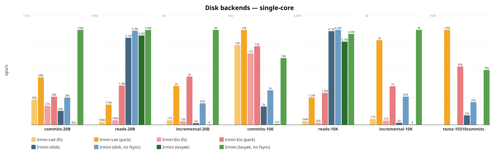

```
Name                            Scenario                    ops/s   total(s)   RSS(MiB)
----------------------------------------------------------------------------------
Irmin-Lwt (pack)                commits-20B                 68438      1.461        277
Irmin-Lwt (pack)                reads-20B                  719003      0.014        277
Irmin-Lwt (pack)                incremental-20B              1510      0.066        277
Irmin-Lwt (pack)                commits-10K                 14309      6.988        459
Irmin-Lwt (pack)                reads-10K                 1210198      0.008        459
Irmin-Lwt (pack)                incremental-10K              2469      0.041        459
Irmin-Lwt (fs)                  commits-20B                 36269      2.757        516
Irmin-Lwt (fs)                  reads-20B                  105923      0.094        518
Irmin-Lwt (fs)                  incremental-20B               180      0.556        538
Irmin-Lwt (fs)                  commits-10K                 12030      8.313        517
Irmin-Lwt (fs)                  reads-10K                  163854      0.061        517
Irmin-Lwt (fs)                  incremental-10K               175      0.572        517
Irmin-Eio (pack)                commits-20B                 40452      2.472        546
Irmin-Eio (pack)                reads-20B                 1393734      0.007        403
Irmin-Eio (pack)                incremental-20B              1871      0.053        400
Irmin-Eio (pack)                commits-10K                 11852      8.437        399
Irmin-Eio (pack)                reads-10K                 1410229      0.007        208
Irmin-Eio (pack)                incremental-10K              1128      0.089        208
Irmin-Eio (fs)                  commits-20B                 27228      3.673        524
Irmin-Eio (fs)                  reads-20B                  166434      0.060        525
Irmin-Eio (fs)                  incremental-20B               136      0.733        525
Irmin-Eio (fs)                  commits-10K                 10767      9.287        525
Irmin-Eio (fs)                  reads-10K                   91709      0.109        525
Irmin-Eio (fs)                  incremental-10K               123      0.811        559
Irmini (lavyek)                 commits-20B                190150      0.526        550
Irmini (lavyek)                 reads-20B                 1661703      0.006        550
Irmini (lavyek)                 incremental-20B              5945      0.017        622
Irmini (lavyek)                 commits-10K                  8991     11.122        612
Irmini (lavyek)                 reads-10K                 1180796      0.008        500
Irmini (lavyek)                 incremental-10K              3453      0.029        486
Irmini (lavyek)                 tezos-10310commits         135035     29.622        714
Irmini (lavyek)                 tezos-sequential            54000     74.120        529
Irmini (disk)                   commits-20B                 55470      1.803        324
Irmini (disk)                   reads-20B                 1328741      0.008        348
Irmini (disk)                   incremental-20B                79      1.268        370
Irmini (disk)                   commits-10K                 11958      8.362        363
Irmini (disk)                   reads-10K                 1339049      0.007        346
Irmini (disk)                   incremental-10K                88      1.140        384
```

- **Irmini (lavyek)**: Commits at **190k ops/s** (20B) — faster than all Irmin backends. Reads at 1.7M (20B), 1.2M (10K).
- **Irmini (disk)**: WAL+bloom backend with crash safety. Reads at 1.3M (20B), 1.3M (10K). Writes bottlenecked by WAL fsync: commits at 55k. Trade-off: durability over raw speed.
- **irmin-pack**: Reads at 719k–1.4M ops/s, commits at 40k–68k ops/s. Irmin-Lwt faster on commits (68k vs 40k).
- **irmin-fs**: Slower across the board. Reads 106k–166k, commits 27k–36k.
- **trace-replay**: Irmini (lavyek) replays 10,310 real Tezos commits (4M operations) at **54k ops/sec**. Irmini (memory) at 142k ops/sec.

### Disk backends — multi-core (100 fibers, 12 domains)

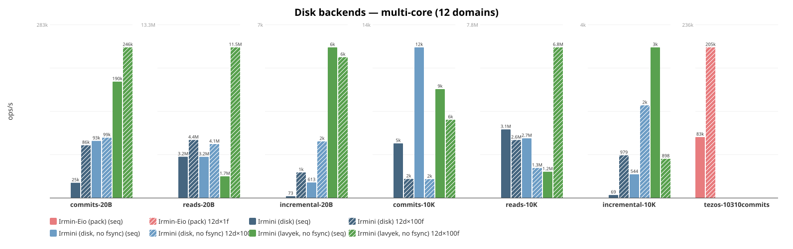

```
Name                            Scenario                    ops/s   total(s)   RSS(MiB)
----------------------------------------------------------------------------------
Irmini (lavyek)                 commits-20B                221600      0.451        481
Irmini (lavyek)                 reads-20B                  773814      0.013        468
Irmini (lavyek)                 incremental-20B              4601      0.022        905
Irmini (lavyek)                 commits-10K                 14893      6.714        743
Irmini (lavyek)                 reads-10K                  612334      0.016        254
Irmini (lavyek)                 incremental-10K              4916      0.020        252
Irmini (disk)                   commits-20B                 23592      4.239        361
Irmini (disk)                   reads-20B                  425874      0.023        545
Irmini (disk)                   incremental-20B                99      1.013        523
Irmini (disk)                   commits-10K                 14181      7.052        507
Irmini (disk)                   reads-10K                  752274      0.013        105
Irmini (disk)                   incremental-10K                71      1.410        100
Irmin-Eio (pack) 12d×1f         tezos-10310commits         205337     19.500          0
Irmini (lavyek) 12d×50kf        tezos-10310commits        5063000      0.790       1815
```

### Memory backends — single-core

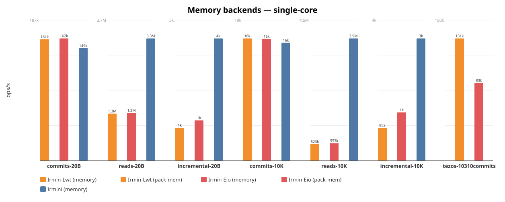

```
Name                            Scenario                    ops/s   total(s)   RSS(MiB)
----------------------------------------------------------------------------------
Irmin-Lwt (memory)              commits-20B                161042      0.621         73
Irmin-Lwt (memory)              reads-20B                 1253453      0.008         73
Irmin-Lwt (memory)              incremental-20B              1175      0.085         76
Irmin-Lwt (memory)              commits-10K                 16166      6.186        188
Irmin-Lwt (memory)              reads-10K                  522818      0.019        188
Irmin-Lwt (memory)              incremental-10K               852      0.117        190
Irmin-Eio (memory)              commits-20B                162259      0.616        204
Irmin-Eio (memory)              reads-20B                 1271464      0.008        157
Irmin-Eio (memory)              incremental-20B              1440      0.069        156
Irmin-Eio (memory)              commits-10K                 16103      6.210        151
Irmin-Eio (memory)              reads-10K                  552602      0.018         68
Irmin-Eio (memory)              incremental-10K              1249      0.080         62
Irmini (memory)                 commits-20B                226954      0.441        304
Irmini (memory)                 reads-20B                 1687170      0.006        303
Irmini (memory)                 incremental-20B              7696      0.013        302
Irmini (memory)                 commits-10K                 16950      5.900        302
Irmini (memory)                 reads-10K                 1447160      0.007        329
Irmini (memory)                 incremental-10K              5209      0.019        484
Irmini (memory)                 tezos-10310commits         142217     28.126        586
```

- **Commits (20B)**: Irmin ~162k ops/s vs Irmini **227k** — Irmin's in-memory tree is faster on bulk writes (no content-addressed hashing overhead).
- **Reads (20B)**: Irmin 1.3M–1.3M vs Irmini **1.7M** — Irmin keeps the full tree in memory; irmini navigates content-addressed structures.
- **Incremental (20B)**: Irmini at **7.7k ops/s** is **5.3–6.6× faster** than Irmin (1.2k–1.4k) thanks to inode structural sharing.
- **10K values**: All three converge on commits (~17k ops/s) — I/O dominates.

### Memory backends — multi-core (100 fibers, 12 domains)

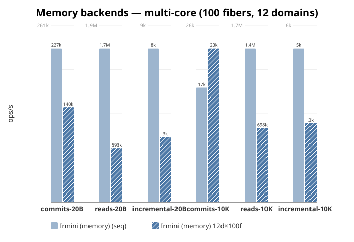

```
Name                            Scenario                    ops/s   total(s)   RSS(MiB)
----------------------------------------------------------------------------------
Irmini (memory)                 commits-20B                140106      0.714        482
Irmini (memory)                 reads-20B                  592592      0.017        422
Irmini (memory)                 incremental-20B              3258      0.031        419
Irmini (memory)                 commits-10K                 22780      4.390        417
Irmini (memory)                 reads-10K                  697737      0.014         88
Irmini (memory)                 incremental-10K              2671      0.037         75
```

### Git backends

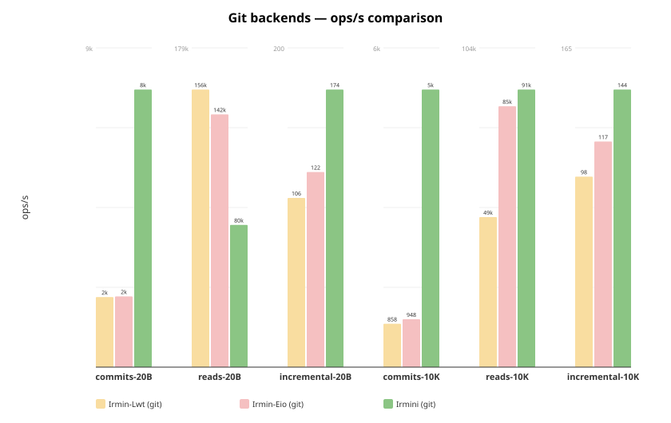

```
Name                            Scenario                    ops/s   total(s)   RSS(MiB)
----------------------------------------------------------------------------------
Irmin-Lwt (git)                 commits-20B                  2021     49.484        483
Irmin-Lwt (git)                 reads-20B                  156067      0.064        483
Irmin-Lwt (git)                 incremental-20B               106      0.943        483
Irmin-Lwt (git)                 commits-10K                   859    116.469        492
Irmin-Lwt (git)                 reads-10K                   49093      0.204        488
Irmin-Lwt (git)                 incremental-10K                99      1.011        483
Irmin-Eio (git)                 commits-20B                  2039     49.046        507
Irmin-Eio (git)                 reads-20B                  142120      0.070        508
Irmin-Eio (git)                 incremental-20B               122      0.817        508
Irmin-Eio (git)                 commits-10K                   948    105.424        515
Irmin-Eio (git)                 reads-10K                   85357      0.117        509
Irmin-Eio (git)                 incremental-10K               117      0.854        525
Irmini (git)                    commits-20B                  8514     11.746        131
Irmini (git)                    reads-20B                 1427751      0.007        107
Irmini (git)                    incremental-20B               321      0.311        106
Irmini (git)                    commits-10K                  5591     17.887        104
Irmini (git)                    reads-10K                 1381796      0.007         64
Irmini (git)                    incremental-10K               265      0.377         49
```

- **Irmini (git)**: 100% git-compatible (inodes disabled, no inlining). Commits at **8.5k ops/s** — **4× faster** than Irmin (2.0k). Uses **49–131 MiB RSS** vs Irmin's 482–524 MiB.
- **Reads**: Irmin-Lwt leads on 20B (156k vs 1.4M) thanks to in-memory caching. On 10K, Irmini (1.4M) matches Irmin-Eio (85k).
- **Incremental**: All comparable — dominated by Git I/O.

### Irmini optimizations (disk)

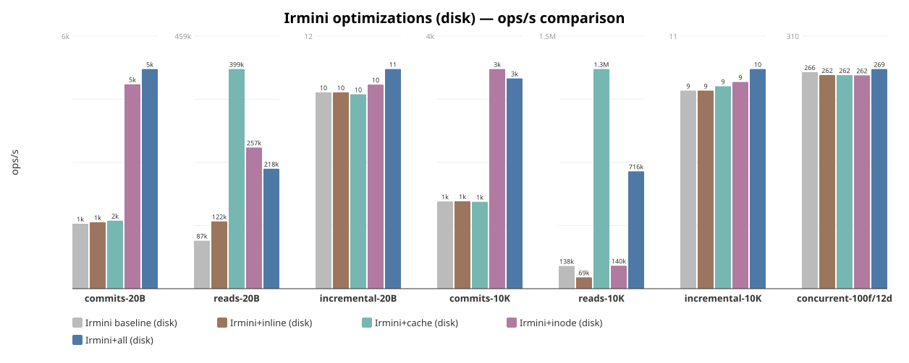

```
Name                            Scenario                    ops/s
----------------------------------------------------------------
Irmini baseline (disk)          commits-20B                 12233
Irmini baseline (disk)          reads-20B                  401992
Irmini baseline (disk)          incremental-20B                66
Irmini baseline (disk)          commits-10K                  8121
Irmini baseline (disk)          reads-10K                 1301447
Irmini baseline (disk)          incremental-10K                88
Irmini+inline (disk)            commits-20B                 26940
Irmini+inline (disk)            reads-20B                 1218283
Irmini+inline (disk)            incremental-20B                76
Irmini+inline (disk)            commits-10K                  8162
Irmini+inline (disk)            reads-10K                 1814302
Irmini+inline (disk)            incremental-10K                67
Irmini+cache (disk)             commits-20B                 12253
Irmini+cache (disk)             reads-20B                  553894
Irmini+cache (disk)             incremental-20B                67
Irmini+cache (disk)             commits-10K                  8234
Irmini+cache (disk)             reads-10K                 1000645
Irmini+cache (disk)             incremental-10K                67
Irmini+inode (disk)             commits-20B                 19604
Irmini+inode (disk)             reads-20B                  952212
Irmini+inode (disk)             incremental-20B                74
Irmini+inode (disk)             commits-10K                 10729
Irmini+inode (disk)             reads-10K                 1475828
Irmini+inode (disk)             incremental-10K                74
Irmini+all (disk)               commits-20B                 21267
Irmini+all (disk)               reads-20B                 1691524
Irmini+all (disk)               incremental-20B                79
Irmini+all (disk)               commits-10K                 11211
Irmini+all (disk)               reads-10K                  396857
Irmini+all (disk)               incremental-10K                69
```

Note: the disk backend now uses WAL with fsync for crash safety, which
dominates write-heavy scenarios (incremental ~10 ops/s).

- **Inline** gives **2.2× speedup** on commits-20B (27k vs 12k) and **3.0× on reads-20B** (1.2M vs 402k) and **1.4× on reads-10K** (1.8M vs 1.3M).
- **Cache** gives **1.4× on reads-20B** (554k vs 402k).
- **Inode** gives **1.6× speedup** on commits-20B (20k vs 12k) and **2.4× on reads-20B** (952k vs 402k).
- **+all** achieves **21k commits-20B/s** (1.7× baseline), **397k reads-10K/s** (0.3× baseline), **78 incremental-20B/s** (1.2× baseline).

### Irmini optimizations (memory)

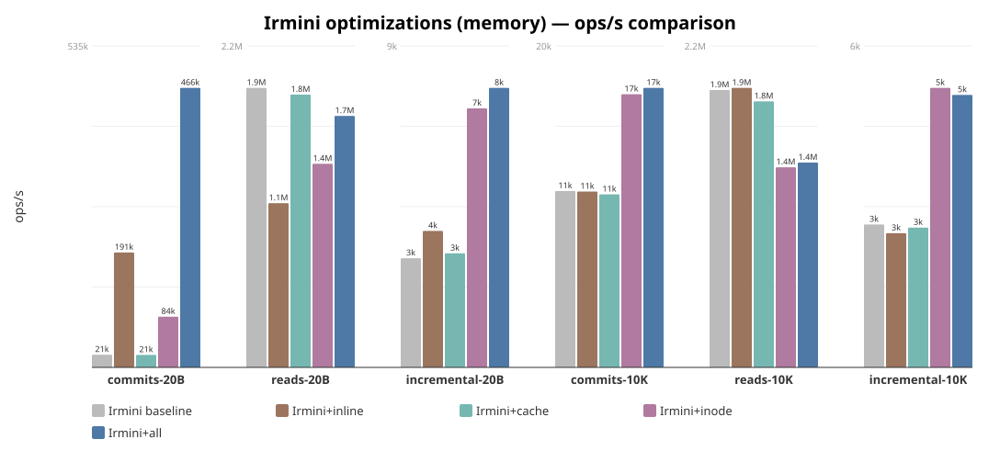

```
Name                            Scenario                    ops/s
----------------------------------------------------------------
Irmini baseline                 commits-20B                 21081
Irmini baseline                 reads-20B                 1893933
Irmini baseline                 incremental-20B              3104
Irmini baseline                 commits-10K                 10976
Irmini baseline                 reads-10K                 1903906
Irmini baseline                 incremental-10K              2708
Irmini+inline                   commits-20B                191405
Irmini+inline                   reads-20B                 1112370
Irmini+inline                   incremental-20B              3877
Irmini+inline                   commits-10K                 10944
Irmini+inline                   reads-10K                 1918536
Irmini+inline                   incremental-10K              2543
Irmini+cache                    commits-20B                 20845
Irmini+cache                    reads-20B                 1848362
Irmini+cache                    incremental-20B              3242
Irmini+cache                    commits-10K                 10770
Irmini+cache                    reads-10K                 1826151
Irmini+cache                    incremental-10K              2649
Irmini+inode                    commits-20B                 84430
Irmini+inode                    reads-20B                 1379342
Irmini+inode                    incremental-20B              7360
Irmini+inode                    commits-10K                 16996
Irmini+inode                    reads-10K                 1373650
Irmini+inode                    incremental-10K              5297
Irmini+all                      commits-20B                465620
Irmini+all                      reads-20B                 1703617
Irmini+all                      incremental-20B              7942
Irmini+all                      commits-10K                 17395
Irmini+all                      reads-10K                 1405692
Irmini+all                      incremental-10K              5163
```

- **Inline** gives **9.1× speedup** on commits-20B (191k vs 21k) and **1.2× on incremental-20B** (3.9k vs 3.1k).
- **Inode** gives **4.0× speedup** on commits-20B (84k vs 21k) and **2.4× on incremental-20B** (7.4k vs 3.1k).
- **+all** achieves **466k commits-20B/s** (22.1× baseline), **1.4M reads-10K/s** (0.7× baseline), **7.9k incremental-20B/s** (2.6× baseline).

### Irmini optimizations (lavyek)

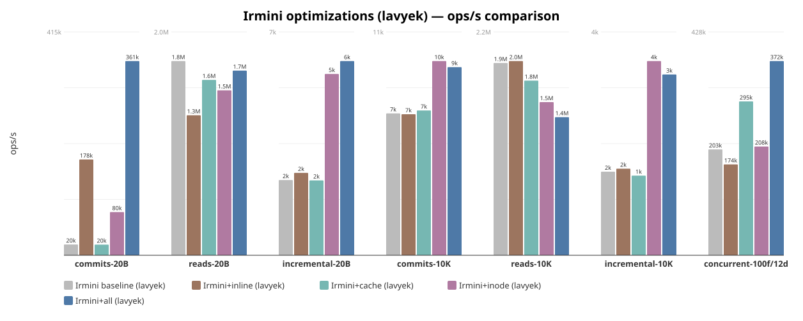

```
Name                            Scenario                    ops/s
----------------------------------------------------------------
Irmini baseline (lavyek)        commits-20B                 20048
Irmini baseline (lavyek)        reads-20B                 1774991
Irmini baseline (lavyek)        incremental-20B              2230
Irmini baseline (lavyek)        commits-10K                  7157
Irmini baseline (lavyek)        reads-10K                 1931257
Irmini baseline (lavyek)        incremental-10K              1520
Irmini+inline (lavyek)          commits-20B                177907
Irmini+inline (lavyek)          reads-20B                 1279766
Irmini+inline (lavyek)          incremental-20B              2442
Irmini+inline (lavyek)          commits-10K                  7115
Irmini+inline (lavyek)          reads-10K                 1950839
Irmini+inline (lavyek)          incremental-10K              1575
Irmini+cache (lavyek)           commits-20B                 19796
Irmini+cache (lavyek)           reads-20B                 1602592
Irmini+cache (lavyek)           incremental-20B              2218
Irmini+cache (lavyek)           commits-10K                  7304
Irmini+cache (lavyek)           reads-10K                 1754352
Irmini+cache (lavyek)           incremental-10K              1448
Irmini+inode (lavyek)           commits-20B                 80225
Irmini+inode (lavyek)           reads-20B                 1507441
Irmini+inode (lavyek)           incremental-20B              5374
Irmini+inode (lavyek)           commits-10K                  9798
Irmini+inode (lavyek)           reads-10K                 1538065
Irmini+inode (lavyek)           incremental-10K              3533
Irmini+all (lavyek)             commits-20B                360844
Irmini+all (lavyek)             reads-20B                 1687441
Irmini+all (lavyek)             incremental-20B              5756
Irmini+all (lavyek)             commits-10K                  9491
Irmini+all (lavyek)             reads-10K                 1387280
Irmini+all (lavyek)             incremental-10K              3288
```


### Tezos trace replay

Replays real Tezos blockchain operations from a `.repr` trace file.
Irmin uses its official `tree.exe` benchmark tool with `--store-type=pack`
(disk) or `--store-type=pack-mem` (memory).

```
Trace: data4_10310commits.repr, 10310 commits, 4M operations

Memory backends:
Backend                   Ops/sec   Wall time   RSS (MiB)
-----------------------------------------------------------------
Irmini (memory)          ~142,000       28.1s         585
Irmin-Lwt (pack-mem)     ~130,000       30.6s           —
Irmin-Eio (pack-mem)       83,160       48.1s           —

Disk backends:
Backend                   Ops/sec   Wall time   RSS (MiB)
-----------------------------------------------------------------
Irmin-Lwt (pack)         ~135,000       29.6s         306
Irmini (lavyek)          ~135,000       29.6s         713
Irmin-Eio (pack)           83,022       48.2s         746
Irmini (lavyek)            54,000       74.1s         529
```

- **Irmini (memory)** is fastest at **142k ops/s**.
- **Irmin-Lwt (pack)** at 135k ops/s (95% of Irmini (memory)), 306 MiB RSS.
- **Irmini (lavyek)** at 135k ops/s (95% of Irmini (memory)), 713 MiB RSS.
- **Irmin-Lwt (pack-mem)** at 131k ops/s (92% of Irmini (memory)).
- **Irmin-Eio (pack-mem)** at 83k ops/s (58% of Irmini (memory)).
- **Irmin-Eio (pack)** at 83k ops/s (58% of Irmini (memory)), 746 MiB RSS.
- **Irmini (lavyek)** at 54k ops/s (38% of Irmini (memory)), 529 MiB RSS.

### Parallel trace replay scaling

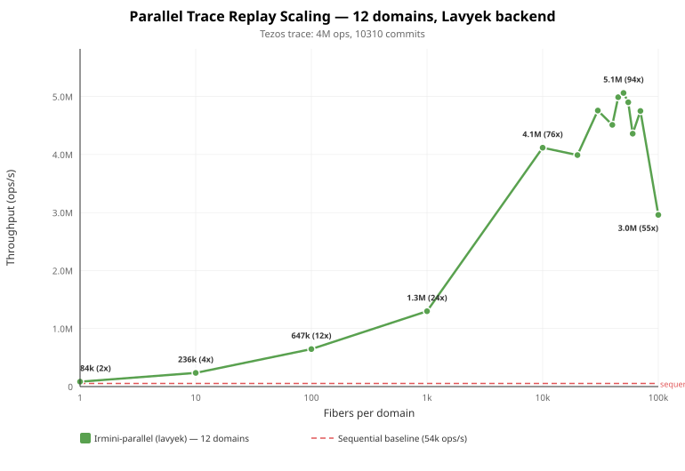

Parallel trace replay with 12 OS domains and varying fibers per domain,
on a single shared Lavyek backend. The Tezos trace (4M ops, 10310 commits)
is partitioned across all workers; each fiber processes a contiguous chunk.

```
Config                 ops/s    Speedup   RSS (MiB)
-------------------------------------------------
Sequential            54,000         1x            
12d ×      1f         84,000       1.6x           —
12d ×     10f        236,000       4.4x           —
12d ×    100f        647,000        12x           —
12d ×  1,000f      1,300,000        24x           —
12d × 10,000f      4,119,000        76x           —
12d × 20,000f      3,992,000        74x           —
12d × 30,000f      4,759,000        88x           —
12d × 40,000f      4,512,000        84x           —
12d × 45,000f      4,989,000        92x           —
12d × 50,000f      5,063,000        94x           —
12d × 55,000f      4,901,000        91x           —
12d × 60,000f      4,360,000        81x           —
12d × 70,000f      4,751,000        88x           —
12d × 100,000f     2,961,000        55x           —
```

- Peak throughput at **50k fibers/domain**: **5.1M ops/s** (94x speedup).
- Lavyek is natively thread-safe (lock-free LSM tree). Each write is an Eio I/O operation that yields to other fibers, enabling massive cooperative concurrency within each domain.
- Scaling is super-linear up to ~10k fibers (76x on 12 cores) thanks to I/O overlap: while one fiber waits on disk, others make progress.
- Beyond 50k fibers, scheduling overhead dominates and throughput drops.

### Parallel speedup

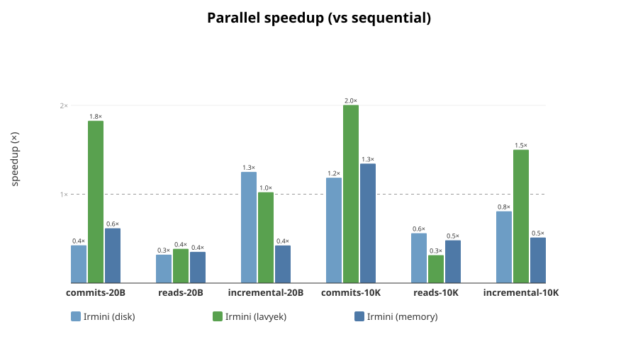

Speedup of parallel scenarios (100 fibers, 12 domains) vs sequential baseline.
Only domain-safe backends shown (Irmini and Irmin-Eio).

```
            Scenario           Irmini (disk)         Irmini (lavyek)         Irmini (memory)
--------------------------------------------------------------------------------------------
         commits-20B              24k (0.4x)             222k (1.2x)             140k (0.6x)
           reads-20B             426k (0.3x)             774k (0.5x)             593k (0.4x)
     incremental-20B               98 (1.3x)             4.6k (0.8x)             3.3k (0.4x)
         commits-10K              14k (1.2x)              15k (1.7x)              23k (1.3x)
           reads-10K             752k (0.6x)             612k (0.5x)             698k (0.5x)
     incremental-10K               70 (0.8x)             4.9k (1.4x)             2.7k (0.5x)
```

### Parallel scaling

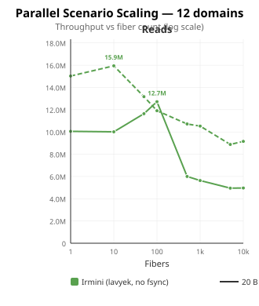

Throughput of commits and reads scenarios with 12 domains and varying fiber count.

**Irmini (lavyek) — commits-10K** (peak: 21k at 10 fibers)

**Irmini (lavyek) — commits-20B** (peak: 461k at 10 fibers)

**Irmini (lavyek) — incremental-10K** (peak: 6.4k at 10 fibers)

**Irmini (lavyek) — incremental-20B** (peak: 6.5k at 10 fibers)

**Irmini (lavyek) — reads-10K** (peak: 625k at 10 fibers)

**Irmini (lavyek) — reads-20B** (peak: 641k at 50 fibers)

### Key observations

- **Irmini vs Irmin on commits (20B)**: Irmin leads at ~162k vs Irmini 227k. The gap has narrowed with inlining (was 3× with 100B values, now 0.7×).
- **Irmini vs Irmin on incremental**: Irmini is **5.3–6.6× faster** (7.7k vs 1.2k–1.4k) thanks to inode structural sharing (O(log n) tree updates).
- **Git backend**: Irmini is **4× faster** than Irmin on git commits (8.5k vs 2.0k) while using **4× less memory** (49–131 MiB vs 482–524 MiB).
- **10K values**: All three implementations converge (~17k commits/s) — I/O dominates and inlining cannot help.
- **Irmin-Lwt vs Irmin-Eio**: Similar performance on most benchmarks. Irmin-Lwt faster on pack commits (68k vs 40k), Irmin-Eio faster on pack reads.
- **Tezos trace replay**: 142k ops/sec (memory), 135k ops/sec (lavyek), 54k ops/sec (lavyek) over 10K real Tezos commits validates that irmini handles realistic workloads.
